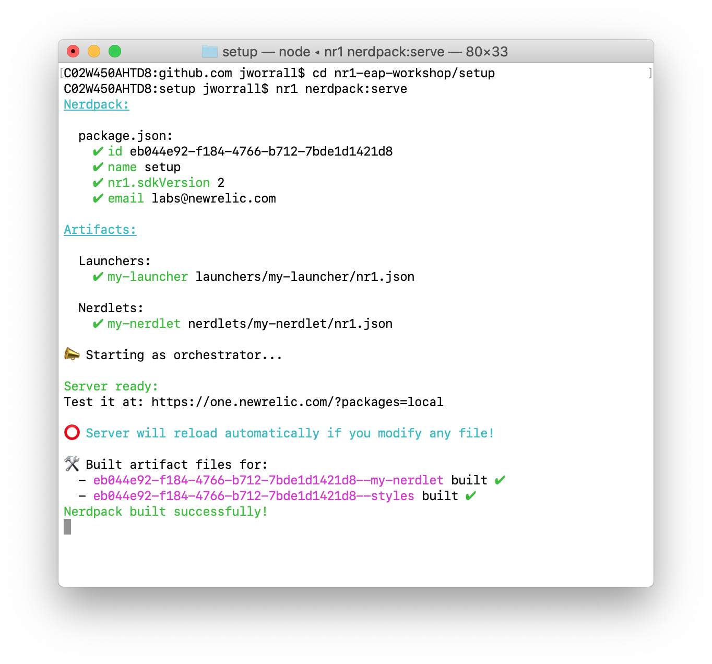
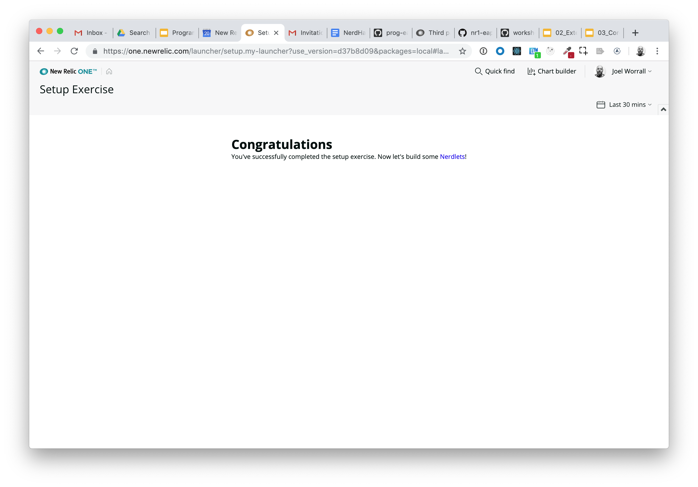

# Welcome!

It's quick and easy to set up your environment to build [New Relic One applications](https://docs.newrelic.com/docs/new-relic-programmable-platform-introduction). In these setup instructions, you'll be setting up your system to run a local server that establishes a connection to the New Relic One platform. This connection makes building your New Relic One application easy because you can see your changes in real time. Enjoy!

# Setup Instructions

To set up your environment to Build your own application:

1. In Google Chrome, go to [one.newrelic.com](one.newrelic.com) and select [**build your own application**](https://one.newrelic.com/launcher/developer-center.launcher#pane=eyJuZXJkbGV0SWQiOiJkZXZlbG9wZXItY2VudGVyLmRldmVsb3Blci1jZW50ZXIifQ==). Follow the instructions.

2. To prepare to do the workshop, you need to clone the workshop repo:

```bash
# if you haven't cloned the workshop repo already
git clone git@github.com:newrelic/nr1-workshop.git
```

_Note: Each exercise exists as a folder in this repository. Following the material will involve going into that directory, running `npm install`, standing up the local development server by running `nr1 nerdpack:serve`, and following the INSTRUCTIONS.md in the given folder._

3. Now start the `setup` NR1 package:

```bash
# ex. change directory into setup
cd workshop/setup
npm install
nr1 nerdpack:uuid -gf
nr1 nerdpack:serve
```

Your terminal output should look like the following:


4. Open Google Chrome and go to [one.newrelic.com?nerdpacks=local](https://one.newrelic.com?nerdpacks=local) (this places locally served applications in New Relic One). Click on the launcher named `Setup exercise`. You should see the following:


Great. [Now let's get started.](https://github.com/newrelic/nr1-workshop)
