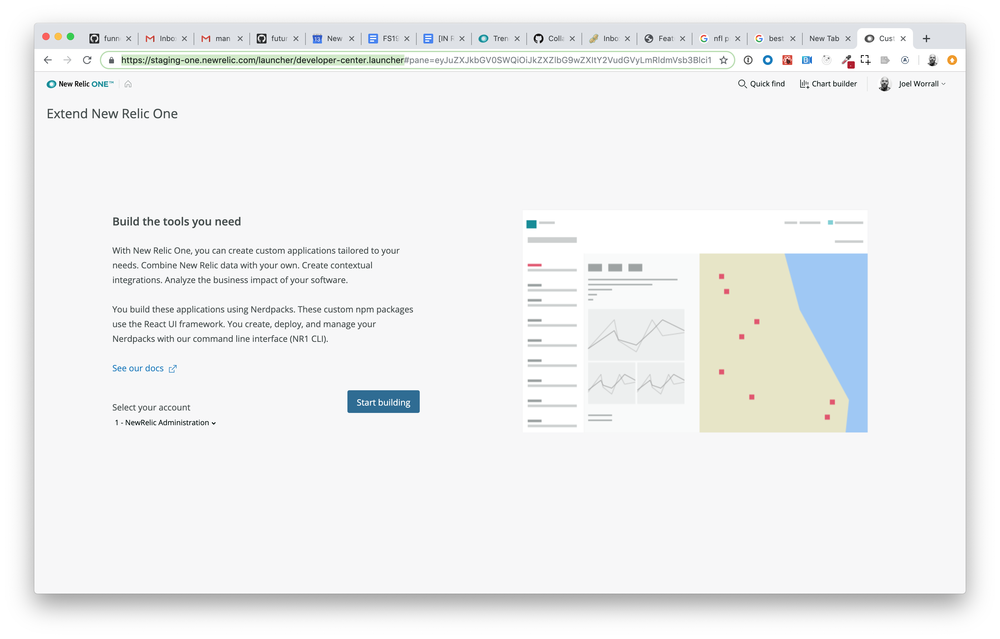
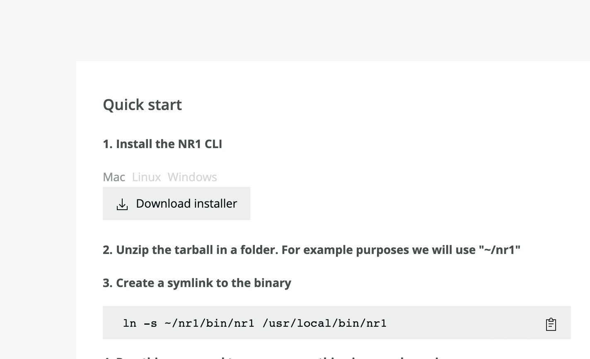
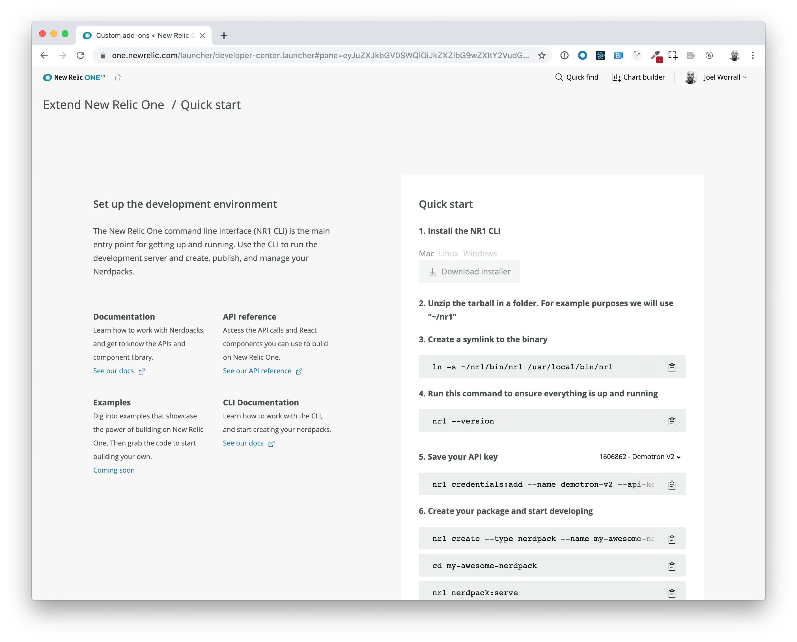

# Welcome!

Getting ready to build on the New Relic One platform is quick and easy. Essentially, what you will be doing in these setup instructions is readying your system to run a local server that seamlessly and securely connects into the New Relic One platform. This connection will makes building visual extension a breeze because you can see your changes in real time. Enjoy!

# Setup Instructions

In Google Chrome, navigate to the [New Relic One Developer Center](https://one.newrelic.com/launcher/developer-center.launcher#pane=eyJuZXJkbGV0SWQiOiJkZXZlbG9wZXItY2VudGVyLmRldmVsb3Blci1jZW50ZXIifQ==), and follow the instructions.



1. Choose an account from the dropdown on the left, click `Start Building`, and accept the developer terms of use.


2. Download the appropriate CLI.



3. Follow the instructions on the screen.




4. And if you haven't already cloned the workshop repo, do that now.

```bash
# if you haven't cloned the workshop repo already
git clone git@github.com:newrelic/nr1-eap-workshop.git
```

_Note: Each exercise exists as a folder in this repository. Following the material will involve going into that directory, running `npm install`, standing up the local development server by running `nr1 nerdpack:serve`, and following the INSTRUCTIONS.md in the given folder._

5. Now start the `setup` NR1 package.

```bash
# ex. change directory into setup
cd workshop/setup

npm install
nr1 nerdpack:serve
```

Your terminal output should look like the following:


6. Open Google Chrome and navigate to  https://one.newrelic.com?&packages=local, and click on the New Relic One Launcher named `Setup Exercise`. You should see the following.


Great. Now let's get going.