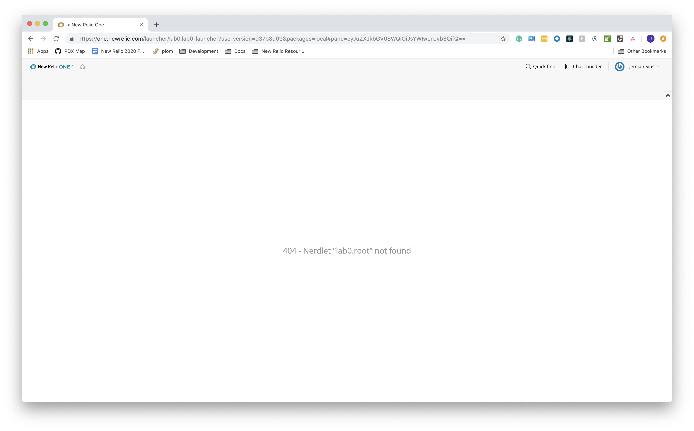
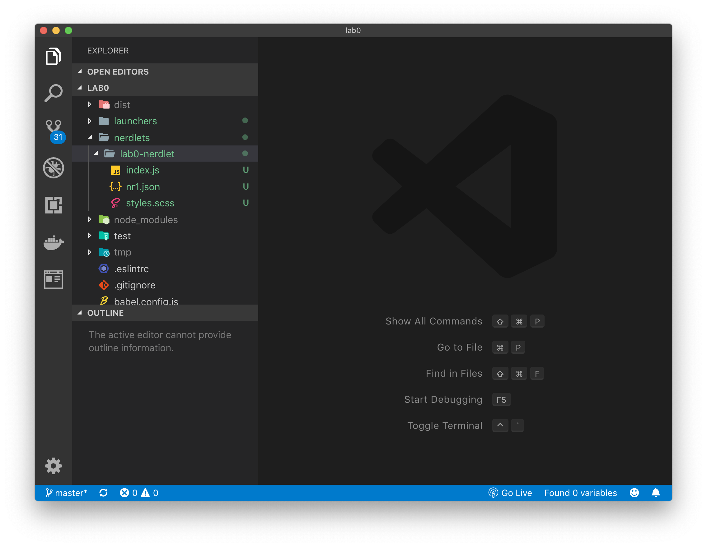
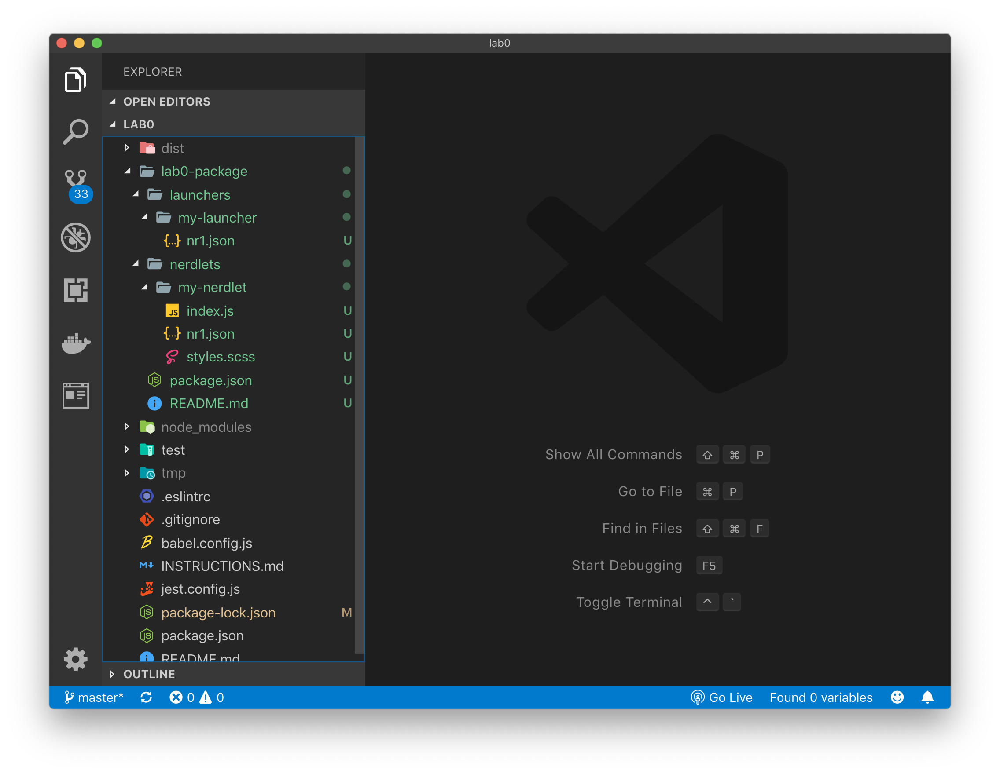

Lab 0: Building your first nerdpack
=======================================================

The purpose of this lab is to provide hands on experience building on top of the New Relic One platform. Following the instructions in this lab, you will be up and running quickly. First, let's make sure you understand a few key concepts that you'll be working with.
* Launcher: An entry point into the New Relic One platform that is loaded on the "Home" page.
* Nerdlet: A visual component that renders inside the New Relic One platform at a well defined exetension point. For example, a Launcher can invoke a nerdlet (as you will see shortly). At their core, nerdlets are React.js components.
* Nerdpack: A collection of artifacts, e.g. nerdlets, that are "packaged" up and published into the New Relic One platform.


In Lab0, you will create a launcher and then add a nerdlet to it that will be invoked when the user clicks on the launcher. After this lab you should understand:

* How to create and locally develop an nerdpack
* How to use the CLI to create a launcher
* How to use the CLI to create a nerdlet
* How to connect a launcher to a nerdlet

# Step 0: Setup and Prerequisites

Load the prerequisites and follow the setup instructions in [Setup](../SETUP.md).

**Reminder**: Make sure that you're ready to go with your `lab0` by ensuring you've run the following commands:

```bash
# from the nr1-eap-workshop directory
cd lab0
npm install
```

# Step 1: Create a launcher
Launchers are a type of artifact within a nerdpack that is selectable form the New Relic One homepage, and serves as an entry to a nerdlet.

1. Use the NR1 CLI to create a launcher

```bash
# assuming we're in nr1-eap-workshop/lab0
nr1 create
? What kind of component do you want to create? launcher
? Name your component. lab0-launcher
Component created successfully!

your lab0-launcher is available at "./lab0/launchers/lab0-launcher"
```
You'll notice that the CLI creates a `./lab0/launchers/lab0-launcher` directory: with a nr1.json configuration.

2. Now that you have a launcher, you can install the dependencies and start the local server.
```bash
npm install
nr1 package:serve
# Note: Once you start the local server, it will automatically listen for changes in the file system. To issue commands while the local server is running, simply open a new terminal and change to the lab0 directory.
```
Navigate in Google Chrome to https://one.newrelic.com/?use_version=45a97944&packages=local and click on the Lab 0 Launcher.


3. Your browser should look like the screenshot below showing a 404 error message. Why? Remember that a launcher is the entry point on the Home page to a specific nerdlet. Currently, the Lab 0 launcher is not connected to a nerdlet, which causes an error to be displayed. Let's fix that by creating a nerdlet and connecting it to the Lab 0 Launcher.



In the next steps we'll create a new nerdlet and connect our launcher to this nerdlet.


# Step 2: Create a nerdlet
A nerdlet is the main artifact that is included within an nerdpack. A nerdlet consists of three files by default: index.js, styles.scss, and a nr1.json configuration.

Within a nerdlet is where the bulk of the code in your nerdpack will live.

1. Use the CLI to create a nerdlet

```bash
# assuming we're in nr1-eap-workshop/lab0
nr1 create
? What kind of component do you want to create? nerdlet
? Name your component. lab0-nerdlet
Component created successfully!

your lab0-nerdlet is available at "./lab0/nerdlets/lab0-nerdlet"
```

You'll notice that the CLI creates three files in the `./lab0/nerdlets/lab0-nerdlet` directory: index.js, styles.scss, and a nr1.json configuration.

2. Open the project in your text editor or IDE (reminder: these instructions assume Visual Studio Code, but you are free to use the IDE of your choice. Here's a shout out to all the VI users!!)

```bash
# if you're not there already, navigate to the workshop directory
cd nr1-eap-workshop/lab0
# open the current project directory in your IDE
code .
# voilà
```

3. A nerdlet is created and added to the `./lab0/nerdlets` folder. Your code editor should look similar to the screenshot below:




# Step 3: Connecting your launcher and nerdlet

1. Within `./lab0/launchers/lab0-launcher` open the launcher `nr1.json` configuration file adding the correct `rootNerdletId`


2. Replace the code within your `./lab0/launchers/lab0-launcher/nr1.json` with the JSON object below.

```bash
{
    "schemaType": "LAUNCHER",
    "id": "lab0-launcher",
    "displayName": "Lab 0 Launcher",
    "description": "",
    "icon": "interface_placeholders_icon-placeholder",
    "rootNerdletId": "lab0.lab0-nerdlet"
}

```

3. Save the nr1.json, then navigate back https://one.newrelic.com/?use_version=45a97944&packages=local and click on the Lab 0 Launcher. Your browser window should look similar to below with the `lab0-nerdlet` launched.


_Note: if not, restart your local developer server by typing a Ctrl+c in the Terminal and then running nr1 package:serve.

# Step 4: Creating a package

## What is a package? ##

A package is a deployable unit that contains one or more artifacts.  A nerdlet is the main artifact in of a package, but packages can also include launchers, overlays, hooks, and enitites.

In steps 1 -3 we were creating a `lab0` package. Yet, there is a quicker way to create packages with a launcher and nerdlet already connected.

`nr1 create` will do it for you!

From your root directory (or the directory your want your packages located). Run the following command in your terminal:

```bash
# The CLI will create a new folder to contain the artifacts within your package
nr1 create
? What kind of component do you want to create? package
? Name your component. lab0-package
Component created successfully!

```
You'll notice that the CLI creates a `/lab0-package` directory: including a launchers and nerdlets folder, and all the needed internal files.



# For Consideration / Discussion

- How do you use a nerdlet to build custom visaulizations? How do you access your account data?

