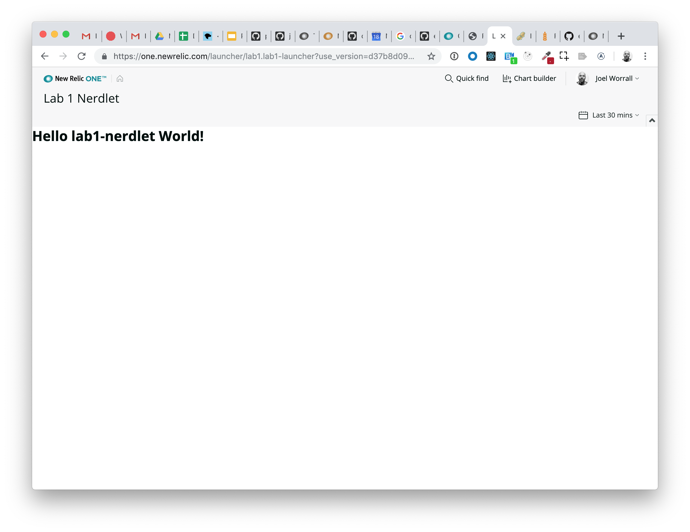
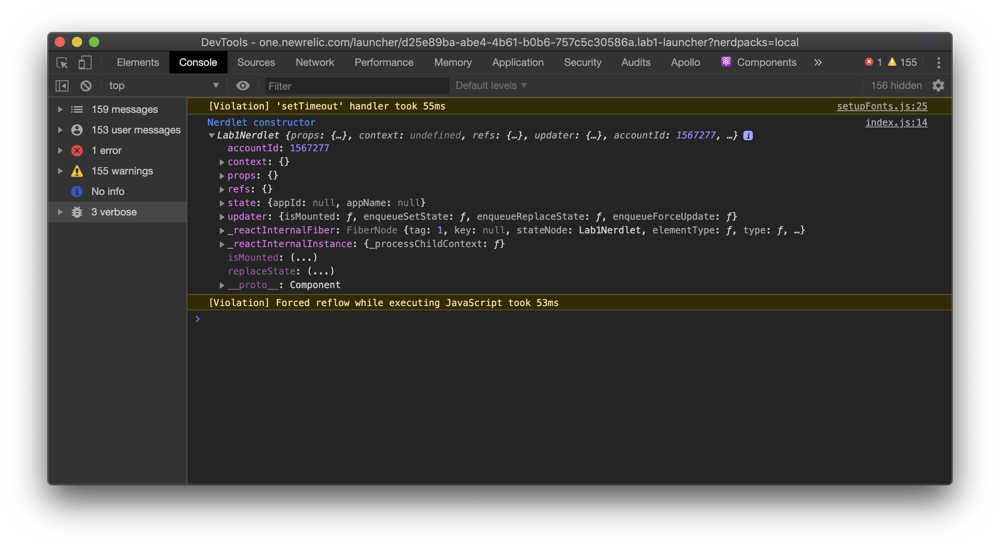
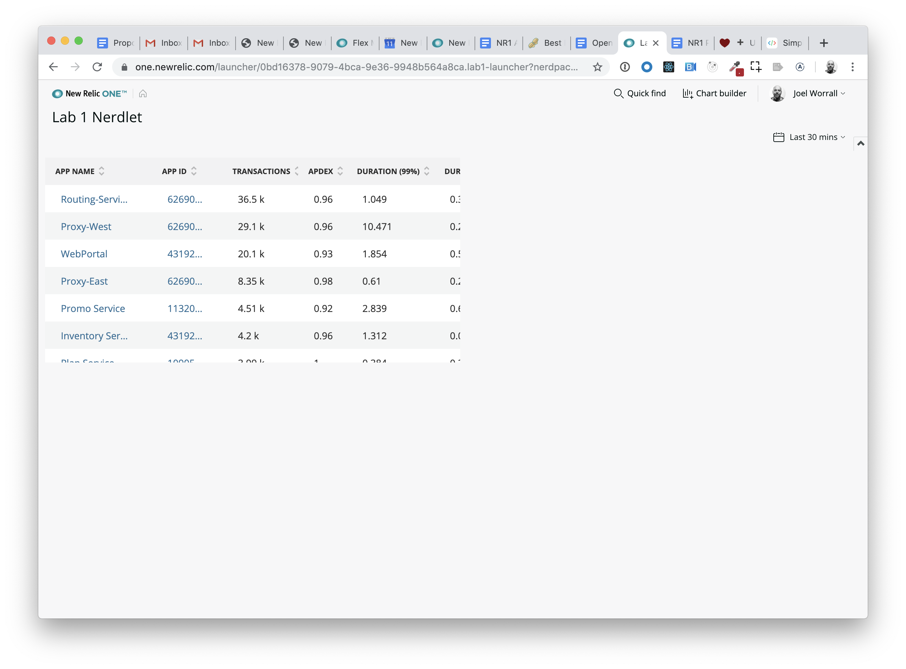
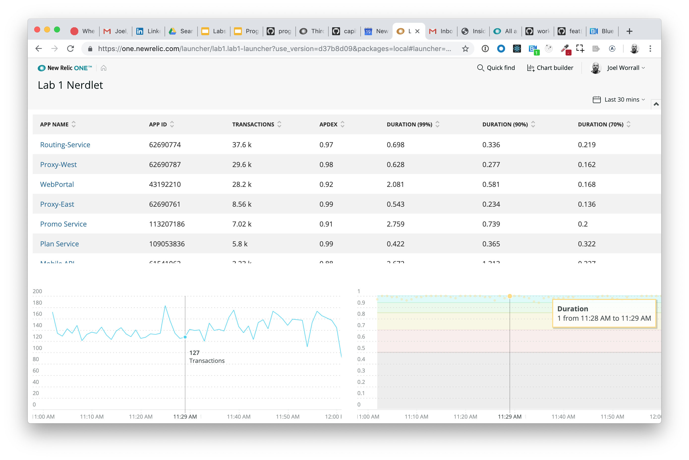
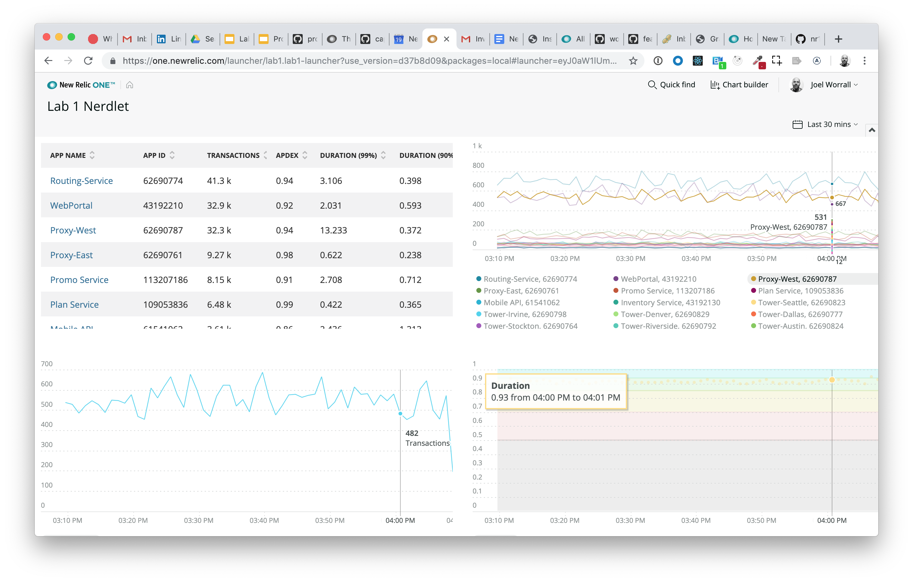

Lab 1: Working with Chart components
===========================================================

The NR1 Chart components allow you to easily add data visualizations to your New Relic One nerdpack. The components take care of everything: from plotting to fetching data, but they can also receive data externally to support custom data sets. The purpose of this lab is to create a Nerdlet that displays data from a custom NRQL query using the Chart components.

After completing this lab you should understand:

* The basics for interacting with the Chart components in a custom Nerdlet

## Step 0: Setup and Prerequisites

Load the prequisites and follow the setup instructions in [Setup](../SETUP.md).

**Reminder**: Make sure that you're ready to go with your `lab1` by ensuring you've run the following commands:

```bash
# from the nr1-workshop directory
cd lab1
nr1 nerdpack:serve -gf
npm install
```

## Step 1: Creating a new Nerdlet
The Nerdlet code that you create in this exercise will be accessed through a prebuilt launcher that is delivered as part of Lab 1. We will cover the details of launchers in a future exercise.

1. Run the `nr1 create` command and choose the option `nerdlet` as well as provide a name of `lab1-nerdlet`. See the following:

```bash
#Assuming we're in the lab1 directory
nr1 create
? What kind of component do you want to create? nerdlet
? Name your component. lab1-nerdlet
Component created successfully!
nerdlet lab1-nerdlet is available at "./nerdlets/lab1-nerdlet"

#And if it's not already running, execute the following
nr1 nerdpack:serve
```

You'll notice that the CLI creates three files in the `nerdlets/lab1-nerdlet` directory: index.js, styles.scss, and a nr1.json configuration.

2. Assuming the the developer server is still running (via `nr1 nerdpack:serve`), validate (in a web browser) that you can click on and see the `Lab 1 Launcher` launcher by navigating in Google Chrome to https://one.newrelic.com?nerdpacks=local and click on the `Lab 1 Launcher`.

3. Change the `displayName` property of the Nerdlet in `nerdlets/lab1-nerdlet/nr1.json` to `Lab 1 Nerdlet` and save that file.

4. Check Google Chrome. You should see the following:



_Note: if not, restart your local developer server by typing a `Ctrl`+`c` in the Terminal and then running `nr1 nerdpack:serve`._

5. Next, we're going to prep the Nerdlet to be able to generate some charts. Add the following code to your `Lab1Nerdlet` class in `nerdlets/lab1-nerdlet/index.js`.

```javascript
    constructor(props) {
        super(props);
        this.accountId = 1606862; //New Relic Demotron.
        this.state = {
            appId: null,
            appName: null
        };
        console.debug("Nerdlet constructor", this); //eslint-disable-line
    }
```

_Note: The value of the accountId just needs to be a New Relic account to which you have access. Replace `1606862` with any valid New Relic accountId to which you have access._

6. Save `index.js` and watch the `Lab 1 Nerdlet` reload in your Browser.
7. Ctrl+click (or right click) on the web browser screen displaying our Nerdlet and choose the menu item `Inspect`.
8. In the DevTools window now open, click on the `Console` tab at the top.
9. In the `Console` tab, choose the `verbose` option on the left hand side. (It's in the drop-down next to the 'Filter' bar.)
10. Go back to the browser window and reload the current page, and then go back to the DevTools window. You should be looking at a screen like the following:

You may get a notification at the top of your debug window indicating that you do not have the 'React DevTools' loaded. If you would like to load the [React DevTools extension](https://github.com/facebook/react-devtools), you can click on this link and load the [chrome extension](https://chrome.google.com/webstore/detail/react-developer-tools/fmkadmapgofadopljbjfkapdkoienihi?hl=en) (or [firefox exetension](https://addons.mozilla.org/en-US/firefox/addon/react-devtools/)). You should become familiar with using the developer tools as a way to explore the values of your objects on the client. Take a moment now to explore the objects returned to the console.

## Step 2: Exploring the Chart components

_Note: When the documentation for the NR1 SDK is available, we'll replace the link to the PDF with the specific, published docs. That will be part of the rev. 1 of this training._

1. Open the [provided documentation](http://nr3.nr-assets.net.s3.amazonaws.com/docs/index.html) in this documentation.
2. Find the `TableChart` documentation and explore its Usage, Example, and Config content.
3. Find the `ScatterChart` documentation and explore its Usage, Example, and Config content.
4. Find the `LineChart` documentation and explore its Usage, Example, and Config content.
5. Find the `ChartGroup` documentation and explore its usage and example content.

In the next few sections, we're going to create an interface that explores the relationship between the volume of transactions over time and **apdex** metric using the components we just reviewed.

## Step 3: Building a table component into our Nerdlet

1. Add the following import statement near the top of `lab1/nerdlets/lab1-nerdlet/index.js`. This will bring in the TableComponent from the datanerd npm lirary that you named in the setup and prerequisites step.

```javascript
import { TableChart, Stack, StackItem } from 'nr1';
```

2. Add the following code to the `lab1/nerdlets/lab1-nerdlet/styles.scss` file.

```scss
.chart {
    padding: 10px;
    width: 48vw;
    height: 45vh;
}
```

3. Now, let's use the `TableChart` to display a simple table with apdex information. Replace the `render` method of `lab1/nerdlets/lab1-nerdlet/index.js` with the following, save the file, and validate the the component renders. The Nerdlet framework will recognize the `query` object passed as an argument into the `TableChart` in the `render` method, and will, under the covers, execute the NRQL statement as part of a GraphQL query.

```javascript
    render(){
        const { appId, appName } = this.state;
        const nrql = `SELECT count(*) as 'transactions', apdex(duration) as 'apdex', percentile(duration, 99, 90, 70) FROM Transaction facet appName, appId limit 25`;
        //return the JSX we're rendering
        return (
            <Stack
                directionType={Stack.DIRECTION_TYPE.VERTICAL}
                gapType={Stack.GAP_TYPE.EXTRA_LOOSE}>
                <StackItem>
                    <TableChart query={nrql} accountId={this.accountId} className="chart" />
                </StackItem>
            </Stack>
        )
    }
```

4. Save the files and check your web browser to see a reloaded experience that looks something like the following.



## Step 4: Adding the detail charts

In this step, we're going to add two detail charts and wrap them in a `ChartGroup` that will ensure synchronized effects across the charts.

1. Modify the `nr1` import statement at the top of `lab1/nerdlets/lab1-nerdlet/index.js` to the following.

```javascript
import { TableChart, Stack, StackItem, ChartGroup, LineChart, ScatterChart } from 'nr1';
```

2. We're going to add several components (spelled out in the block of code further below) to the `render` method:
    - a `ChartGroup`
    - within the `ChartGroup` a `LineChart` to chart the timeseries number of transactions using the NRQL query `SELECT count(*) FROM Transaction WHERE appId = ${appId} TIMESERIES` as the source of its data.
    - within `ChartGroup` a `ScatterChart` to plot the duration of requests over time using the NRQL query `SELECT apdex(duration) FROM Transaction WHERE appId = ${appId} TIMESERIES` as the source of its data.
    - We're also going to make use of additional `Stack` and `StackItem` components. _For now, just use the code. We'll explain more about their purpose in a future exercise._

That all results in the following block of code. Copy/reproduce the code below as the replacement for the `render` method of the `index.js` file:

```javascript
     render(){
        const { appId, appName } = this.state;
        const nrql = `SELECT count(*) as 'transactions', apdex(duration) as 'apdex', percentile(duration, 99, 90, 70) FROM Transaction facet appName, appId limit 25`;
        const tCountNrql = `SELECT count(*) FROM Transaction WHERE appId = ${appId} TIMESERIES`;
        const apdexNrql = `SELECT apdex(duration) FROM Transaction WHERE appId = ${appId} TIMESERIES`
        //return the JSX we're rendering
        return (
            <ChartGroup>
                <Stack
                    directionType={Stack.DIRECTION_TYPE.VERTICAL}
                    gapType={Stack.GAP_TYPE.EXTRA_LOOSE}>
                    <StackItem>
                        <TableChart query={nrql} accountId={this.accountId} className="chart" />
                    </StackItem>
                    {appId && <StackItem>
                        <Stack
                            directionType={Stack.DIRECTION_TYPE.HORIZONTAL}
                            gapType={Stack.GAP_TYPE.EXTRA_LOOSE}>
                            <StackItem>
                                <LineChart accountId={this.accountId} query={tCountNrql} className="chart"/>
                            </StackItem>
                            <StackItem>
                                <ScatterChart accountId={this.accountId} query={apdexNrql} className="chart"/>
                            </StackItem>
                        </Stack>
                    </StackItem>}
                </Stack>
            </ChartGroup>
        )
    }
```

_Note that the line containing `{appId && <Stack...` ensures that the lower section of content displays **only** when an `appId` is present. We haven't set that value in the `state` of the component yet, so we won't see the second row._

3. Save the file and reload the page in the web browser.

Note that the second row of additional charts is never drawm because the `state.appId` is always NULL. There's presently no way to set its value. Let's fix that.

4. Add the following method to your Nerdlet React component, e.g. after the `contructor(props)` we added above:

```javascript
    setApplication(inAppId, inAppName) {
        this.setState({ appId: inAppId, appName: inAppName })
    }
```

1. Add a new attribute named `onClickTable` to the existing `TableChart` as a way to configure a `click` event on the table rows.

The onClickTable receives four parameters that each provide a different view of the overall data.
- dataEl: The inner contents of the specific Table element on which the user clicked.
- row: a JS object of the data that makes up the entire row of that table
- chart: the entire JS object used to generate the chart, both headings and data rows

```javascript
    <TableChart query={nrql} accountId={this.accountId} className="chart" onClickTable={(dataEl, row, chart) => {
            //for learning purposes, we'll write to the console.
            console.debug([dataEl, row, chart]) //eslint-disable-line
            this.setApplication(row.appId, row.appName)
    }}/>
```

1. The resulting `index.js` should look like the following:

```javascript
import React from 'react';
import PropTypes from 'prop-types';
import { TableChart, Stack, StackItem, ChartGroup, LineChart, ScatterChart } from 'nr1';

export default class Lab1Nerdlet extends React.Component {

    constructor(props) {
        super(props);
        this.accountId = 1606862; //New Relic Demotron.
        this.state = {
            appId: null,
            appName: null
        };
        console.debug("Nerdlet constructor", this); //eslint-disable-line
    }

    setApplication(inAppId, inAppName) {
        this.setState({ appId: inAppId, appName: inAppName })
    }

    render(){
        const { appId, appName } = this.state;
        const nrql = `SELECT count(*) as 'transactions', apdex(duration) as 'apdex', percentile(duration, 99, 90, 70) FROM Transaction facet appName, appId limit 25`;
        const tCountNrql = `SELECT count(*) FROM Transaction WHERE appId = ${appId} TIMESERIES`;
        const apdexNrql = `SELECT apdex(duration) FROM Transaction WHERE appId = ${appId} TIMESERIES`
        //return the JSX we're rendering
        return (
            <ChartGroup>
                <Stack
                    directionType={Stack.DIRECTION_TYPE.VERTICAL}
                    gapType={Stack.GAP_TYPE.EXTRA_LOOSE}>
                    <StackItem>
                            <TableChart query={nrql} accountId={this.accountId} className="chart" onClickTable={(dataEl, row, chart) => {
                                //for learning purposes, we'll write to the console.
                                console.debug([dataEl, row, chart]) //eslint-disable-line
                                this.setApplication(row.appId, row.appName)
                            }}/>
                    </StackItem>
                    {appId && <StackItem>
                        <Stack
                            directionType={Stack.DIRECTION_TYPE.HORIZONTAL}
                            gapType={Stack.GAP_TYPE.EXTRA_LOOSE}>
                            <StackItem>
                                <LineChart accountId={this.accountId} query={tCountNrql} className="chart"/>
                            </StackItem>
                            <StackItem>
                                <ScatterChart accountId={this.accountId} query={apdexNrql} className="chart"/>
                            </StackItem>
                        </Stack>
                    </StackItem>}
                </Stack>
            </ChartGroup>
        )
    }
}
```

1. Save the file and reload the page. You should be able to click on an application and see the resulting second row of charts. :sparkles:



## Extra Credit: Adding a second summary chart

Based on what you've executed above, apply that learning in the following:

1. **Replicate** the `Stack` and `StackItem` code from the lower part of the display (i.e. the portion containing the `ScatterChart` and `LineChart`) into the upper half of the display that currently only contains a `TableChart`.

*Note: We're going to add a `LineChart` next to our `TableChart`, which will require a `Stack` with in the very first `StackItem` that itself contains another `Stack` with two `StackItem` elements.*

2. Within the first, **new** `StackItem` element, place the existing `TableChart`.
3. Next to the `TableChart` in the second `StackItem`, add a `LineChart` using the following NRQL query: `SELECT count(*) as 'transactions' FROM Transaction facet appName, appId limit 25 TIMESERIES`.

4. Add a `onClickLine` attribute to your `LineChart` that processes `onClick` events in the same way that the `TableChart` `onTableClick` operates (i.e. calling the `this.setApplication` method). See the following:

```javascript
    <LineChart
        query={`SELECT count(*) as 'transactions' FROM Transaction facet appName, appId limit 25 TIMESERIES`}
        className="chart"
        accountId={this.accountId}
        onClickLine={(line) => {
            //more console logging for learning purposes
            console.debug(line); //eslint-disable=line
            const params = line.metadata.label.split(",");
            this.setApplication(params[1], params[0]);
        }}
    />
```



# For Consideration / Discussion

- _What was the purpose of the `ChartGroup`? What is it doing for us?_
