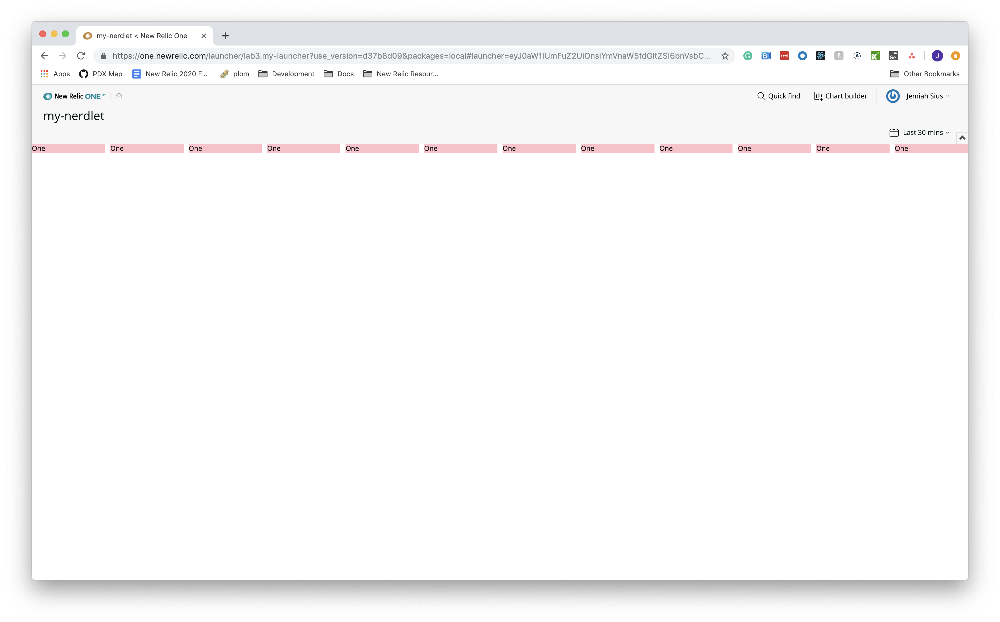
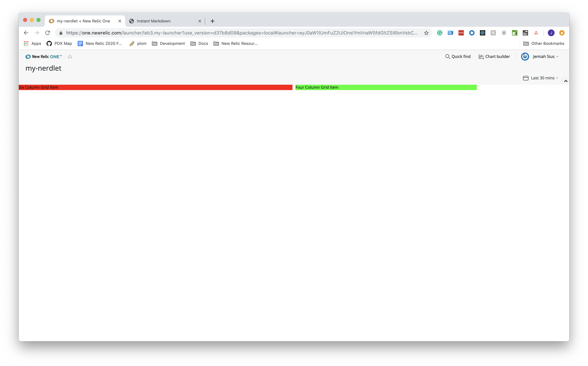
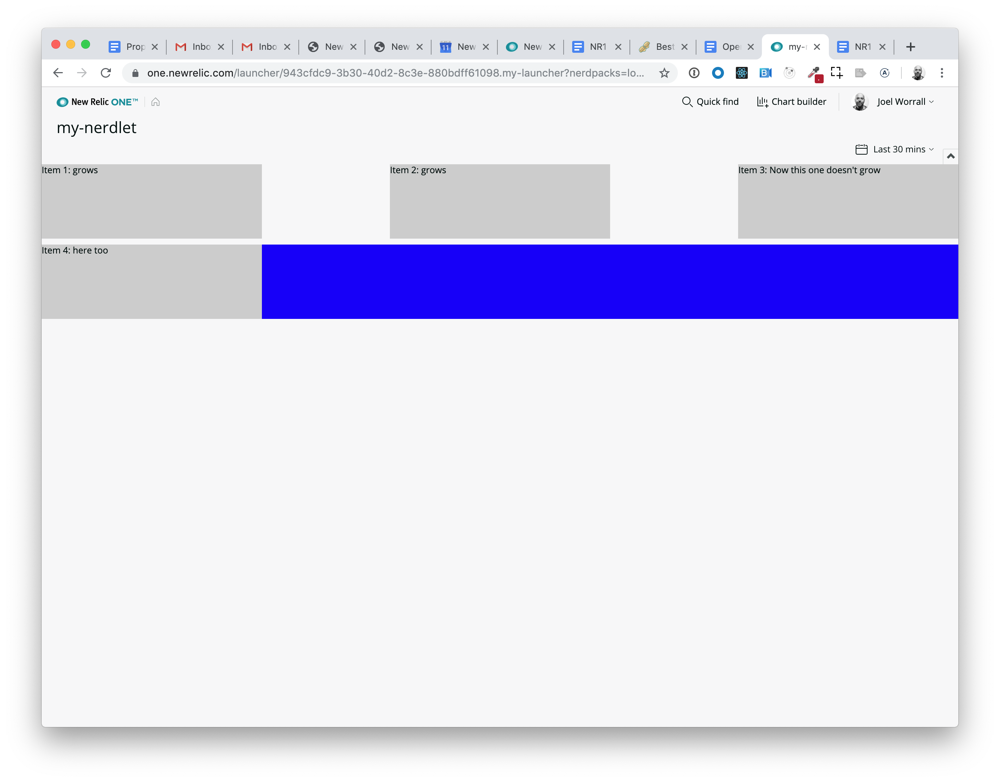
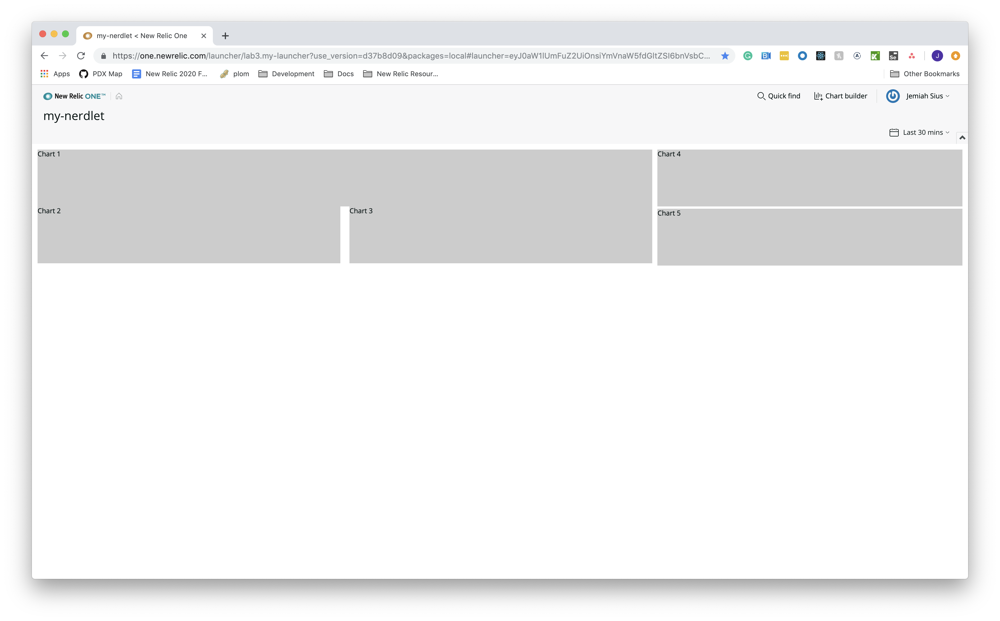
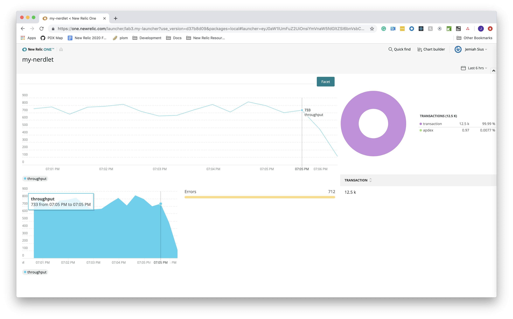
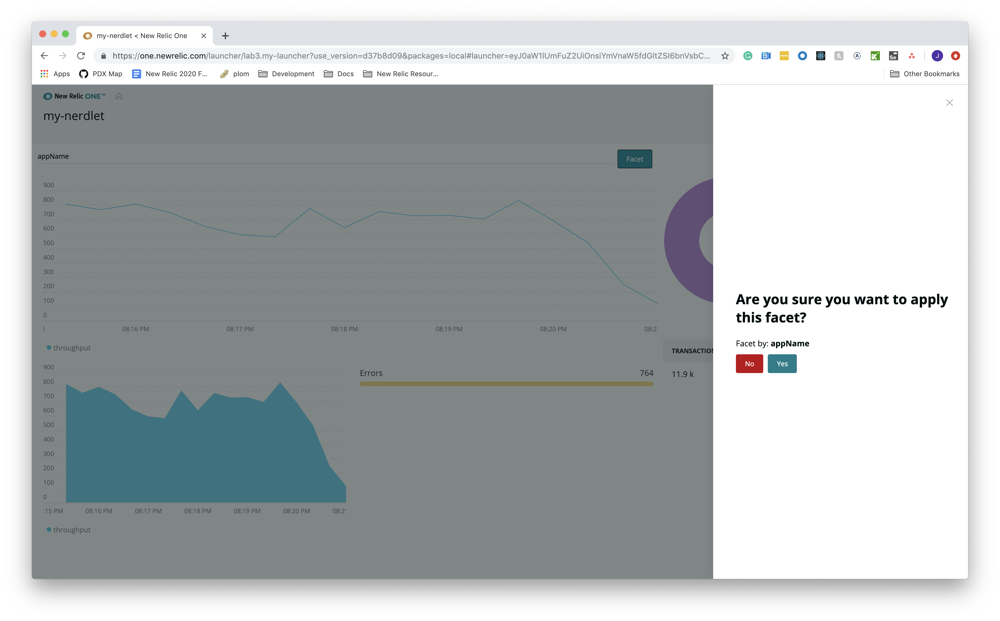
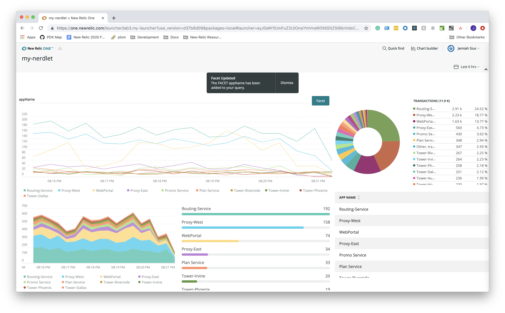

Lab 3: Grids, Stacks, and UI components
===========================================================

The purpose of this lab is learn how to create advanced layouts in your Nerdlet as well as the `navigation` class in the `nr1` library.

After completing this lab you should:

## Step 0: Setup and Prerequisites

Load the prequisites and follow the setup instructions in [Setup](../SETUP.md).

**Reminder**: Make sure that you're ready to go with your `lab3` by ensuring you've run the following commands:

```bash
# from the nr1-eap-workshop directory
cd lab3
npm install
npm start
```

## Step 1: Using the Grid and Grid Items Components

The `<Grid>` UI component is a layout component that only accepts `GridItem` components and works as standard 12-column grid system. Each `<GridItem>` within a `<Grid>` can have be give a column span of 1-12 that determines it's width and a can not exceed 12 columns without wrapping.

1. Import the `<Grid>` and `<GridItem>` from the `nr1` library.

Open the `lab3/nerdlets/my-nerdlet/index.js` and the import statment below.

```javascript
import {Grid, GridItem} from 'nr1';
```

2. Replace the render method within `lab3/nerdlets/my-nerdlet/index.js`

```javascript
    render() {
        const gridItems = [];
        for(let i=0; i<12; i++){
            gridItems.push(<GridItem
                key={i}
                columnSpan={1}
                style={{backgroundColor: "pink"}}
            >
                One
            </GridItem>)
        }

        return <Grid>
            {gridItems}
        </Grid>
    }
```

3. Save your `index.js` file and in Google Chrome, navigate to the following URL `https://one.newrelic.com?use_version=45a97944&packages=local` and click my launcher.

Your browsers should show a `Grid` with `GridItems` that looks something similar to below:



4. Changing the `<Grid>` to something more useful.

Replace the render method within `lab3/nerdlets/my-nerdlet/index.js` file and take another look at the Nerdlet in your Chrome browser.

```javascript
    render() {
        return <Grid>
            <GridItem
                columnSpan={6}
                style={{backgroundColor: "#FF0000"}}
            >
                Six Column Grid Item
            </GridItem>
            <GridItem
                columnSpan={4}
                style={{backgroundColor: "#00FF00"}}
            >
                Four Column Grid Item
            </GridItem>
        </Grid>
    }
```

Your browser should show a `Grid` with `GridItems` that looks something similar to below:



_Note: For more documentation on the `Grid` and `GridItem`and their props view the `nr1` object documentation at: [ADD LINK]

## Step 2: Using Stack and StackItems Components

The `<Stack>` is another layout componnet in the New Relic One UI library. A `<Stack>` only accepts `<StackItem>` components and is a simplified verison of flexbox. The `<Stack>` and `<StackItem>` are very powerful, enables the majority of layouts.

1. Importing the `<Stack>` and `<StackItem>`

Inside the `lab3/nerdlets/my-nerdlet/index.js` update the import statement with the one below.

```javascript
import {Grid, GridItem, Stack, StackItem} from 'nr1';
```

2. Creating a simple layout using the `<Stack>` and `<Stack>` components

Replace the render method within `lab3/nerdlets/my-nerdlet/index.js` file and take another look at the Nerdlet in your Chrome browser.

```javascript
render() {
    return <Stack
            className="stack"
            alignmentType={Stack.ALIGNMENT_TYPE.FILL}
            directionType={Stack.DIRECTION_TYPE.VERTICAL}>
            <Stack
                className="inner-stack"
                alignmentType={Stack.ALIGNMENT_TYPE.FILL}
                directionType={Stack.DIRECTION_TYPE.HORIZONTAL}
                distributionType={Stack.DISTRIBUTION_TYPE.FILL_EVENLY}
                gapType={Stack.GAP_TYPE.NORMAL}>
                <StackItem>
                    <div className="gry-div">Item 1</div>
                </StackItem>
                <StackItem>
                    <div className="gry-div">Item 2</div>
                </StackItem>
                <StackItem>
                    <div className="gry-div">Item 3</div>
                </StackItem>
            </Stack>
            <Stack
                className="inner-stack"
                alignmentType={Stack.ALIGNMENT_TYPE.FILL}
                directionType={Stack.DIRECTION_TYPE.HORIZONTAL}>
                <StackItem className="inner-stack">
                    <div className="gry-div">Item 4: This field grows</div>
                </StackItem>
                <StackItem className="inner-stack">
                    <div className="gry-div">Item 5: But, this one doesn't</div>
                </StackItem>
            </Stack>
        </Stack>
    }
```

The power is using `<Stack>` and `<Stack>` components is being able to use their props and easily create a layout that is best for your nerdpack. Let's update props of the code we added before and see what happens to our layout.

Change the render method within your `lab3/nerdlets/my-nerdlet/index.js` with the code below and look at the difference in your browser.

```javascript
render() {
    return <Stack
        className="stack"
        alignmentType={Stack.ALIGNMENT_TYPE.FILL}
        directionType={Stack.DIRECTION_TYPE.VERTICAL}>
        <Stack
            className="inner-stack"
            alignmentType={Stack.ALIGNMENT_TYPE.FILL}
            directionType={Stack.DIRECTION_TYPE.HORIZONTAL}
            gapType={Stack.GAP_TYPE.NORMAL}>
            <StackItem grow="true">
                <div className="gry-div">Item 1</div>
            </StackItem>
            <StackItem grow="true">
                <div className="gry-div">Item 2</div>
            </StackItem>
            <StackItem>
                <div className="gry-div">Item 3: Now this one doesnt grow</div>
            </StackItem>
        </Stack>
        <Stack
            alignmentType={Stack.ALIGNMENT_TYPE.FILL}
            distributionType={Stack.DISTRIBUTION_TYPE.FILL}
            directionType={Stack.DIRECTION_TYPE.VERTICAL}>
            <StackItem className="inner-stack">
                <div className="gry">Item 4: This field grows</div>
            </StackItem>
            <StackItem className="inner-stack">
                <div className="gry">Item 5: But, this one doesn't</div>
            </StackItem>
        </Stack>
    </Stack>
    }
```

Your browser should now look similar to the snapshot below:



_Note: For more documentation on the `Stack` and `StackItem`and their props view the `nr1` object documentation at: [ADD LINK]


## Step 3: Building an nerdpack with UI Components

1. Creating your layout using `<Grid>`, `<GridItem>`, `<Stack>`, and `<StackItem>` compnents

Update the import statement with your code people:

```javascript
import { Grid, GridItem, Stack, StackItem, ChartGroup, AreaChart, BarChart, LineChart, TableChart, PieChart, Button, TextField, Dialog, Toast } from 'nr1';
```

Using the Grid and Stack components you can easily create any layout you wish within your nerdpack. Replace the render method within your `lab3/nerdlets/my-nerdlet/index.js` with the code below:

```javascript
render(){
    return <ChartGroup>
        <div className="grid">
            <Grid className="grid">
                <GridItem
                    columnSpan={8}>
                    <Stack
                        alignmentType={Stack.ALIGNMENT_TYPE.FILL}
                        distributionType={Stack.DISTRIBUTION_TYPE.FILL_EVENLY}
                        gapType={Stack.GAP_TYPE.LOOSE}>
                        <StackItem>
                            <div className="gry-div">Chart 1</div>
                        </StackItem>
                    </Stack>
                    <Stack
                        alignmentType={Stack.ALIGNMENT_TYPE.FILL}
                        distributionType={Stack.DISTRIBUTION_TYPE.FILL_EVENLY}
                        gapType={Stack.GAP_TYPE.LOOSE}>
                        <StackItem>
                            <div className="gry-div">Chart 2</div>
                        </StackItem>
                        <StackItem>
                            <div className="gry-div">Chart 3</div>
                        </StackItem>
                    </Stack>
                </GridItem>
                <GridItem
                    columnSpan={4}>
                    <Stack
                        alignmentType={Stack.ALIGNMENT_TYPE.FILL}xs
                        distributionType={Stack.DISTRIBUTION_TYPE.FILL_EVENLY}
                        gapType={Stack.GAP_TYPE.TIGHT}
                        directionType={Stack.DIRECTION_TYPE.VERTICAL}>
                        <StackItem>
                            <div className="gry-div">Chart 4</div>
                        </StackItem>
                        <StackItem>
                            <div className="gry-div">Chart 5</div>
                        </StackItem>
                    </Stack>
                </GridItem>
            </Grid>
        </div>
    </ChartGroup>
    }
```

Your Nerdlet should look similar to below:



2. Adding Chart Components to you `<Grid>` and `<Stack>`

Now that you have your layout done, let's add a some chart components. Replace the render method within your `lab3/nerdlets/my-nerdlet/index.js` with the code below:

Add the following code to your `index.js` file. ABOVE the `render` method.

```javascript
constructor(props) {
        super(props);
        this.accountId =  1606862; //New Relic Demotron.
        console.debug("Nerdlet props", this.props); //eslint-disable-line
    }
```
Add the following code to your `index.js` file. IN the `render` method before the `return`

```javascript
    const { duration } = this.props.launcherUrlState.timeRange;
    const since = ` SINCE ${duration/1000/60} SECONDS AGO `;
    const errors = `SELECT count(error) FROM Transaction TIMESERIES`;
    const throughput = `SELECT count(*) as 'throughput' FROM Transaction TIMESERIES`;
    const transaction_apdex_by_appname = `SELECT count(*) as 'transaction', apdex(duration) as 'apdex' FROM Transaction limit 25`;
```
Replace the `render` method in your `index.js` with the code below.

```javascript
render(){
        return <ChartGroup>
            <div className="grid">
                <Grid className="grid">
                    <GridItem
                        columnSpan={8}>
                        <Stack
                            alignmentType={Stack.ALIGNMENT_TYPE.FILL}
                            distributionType={Stack.DISTRIBUTION_TYPE.FILL_EVENLY}
                            gapType={Stack.GAP_TYPE.LOOSE}>
                            <StackItem>
                                <div className="chart">
                                <LineChart
                                    query={throughput+since}
                                    accountId={this.accountId}
                                    className="chart"
                                    onClickLine={(line) => {
                                        console.debug(line); //eslint-disable-line
                                    }}
                                />
                                </div>
                            </StackItem>
                        </Stack>
                        <Stack
                            alignmentType={Stack.ALIGNMENT_TYPE.FILL}
                            distributionType={Stack.DISTRIBUTION_TYPE.FILL_EVENLY}
                            gapType={Stack.GAP_TYPE.LOOSE}>
                            <StackItem>
                            <div className="chart">
                                <AreaChart
                                    query={throughput+since}
                                    accountId={this.accountId}
                                    className="chart"
                                    onClickLine={(line) => {
                                        console.debug(line); //eslint-disable-line
                                    }}
                                />
                                </div>
                            </StackItem>
                            <StackItem>
                            <div className="chart">
                                <BarChart className="chart" query={errors+since} accountId={this.accountId} />
                                </div>
                            </StackItem>
                        </Stack>
                    </GridItem>
                    <GridItem
                        columnSpan={4}>
                        <Stack
                            alignmentType={Stack.ALIGNMENT_TYPE.FILL}xs
                            distributionType={Stack.DISTRIBUTION_TYPE.FILL_EVENLY}
                            gapType={Stack.GAP_TYPE.TIGHT}
                            directionType={Stack.DIRECTION_TYPE.VERTICAL}>
                            <StackItem>
                            <div className="chart">
                                <PieChart
                                    className="chart"
                                    query={transaction_apdex_by_appname+since}
                                    accountId={this.accountId}
                                />
                                </div>
                            </StackItem>
                            <StackItem>
                            <div className="chart">
                                <TableChart className="chart" query={transaction_apdex_by_appname+since} accountId={this.accountId}/>
                            </div>
                            </StackItem>
                        </Stack>
                    </GridItem>
                </Grid>
                </div>
            </ChartGroup>
    }
```

Your Nerdlet should look similar to below:



## Interacting with the New Relic One UI

The NR1 library also exposes components that allow you to interact with the New Relic One UI.

In the next few steps we'll add some UI components that updates the UI and add more detail to our charts.

Add the following methods to your code above your render method. These will come in handy later to help us interact with the UI.

```javascript
 handleChange(e){
        this.setState({value: e.target.value})
    }

    onSubmit(e){
        e.preventDefault();
        this.setState({hideDialog: false})
    }

    confirmFacet(e){
        e.preventDefault();
        this.popToast('normal', 'Facet Updated', `The FACET ${this.state.value} has been added to your query.`)
        this.setState({facet: 'FACET '+this.state.value, hideDialog: true});
    }

    rejectFacet(e){
        e.preventDefault();
        this.popToast('critical', 'Facet Rejected', `The FACET ${this.state.value} has been rejected.`)
        this.setState({facet: '', value: '', hideDialog: true});
    }

    popToast(toastType, toastTitle, toastDisplay){
        this.setState({showToast: true, toastType, toastTitle, toastDisplay});
    }
```

Update your constructor method with the code below. This will come in handy as well a little later.

```javascript
constructor(props) {
        super(props);
        this.accountId =  1606862; //New Relic Demotron.
        this.state = {
            value: '',
            facet: '',
            hideDialog: true,
            showToast: false,
            toastType: 'normal',
            toastTitle: '',
            toastDisplay: ''
        }
        console.debug("Nerdlet props", this.props); //eslint-disable-line

        this.handleChange = this.handleChange.bind(this);
        this.onSubmit = this.onSubmit.bind(this);
        this.confirmFacet = this.confirmFacet.bind(this);
        this.rejectFacet = this.rejectFacet.bind(this);
        this.popToast = this.popToast.bind(this);
    }
```

1. Using the `<TextField>`, `<Button>`, and `<Dialog>` component to get and confirm user input

We want to be able to FACET the chart in our Nerdlet to get better more detail from our instrumentation. To do this we will use the `<TextField>` and `<Button>` components to submit the FACET by and verify the input using a `<Dialog>` component.

Update the your render method with the code below:

```javascript
render() {
        const { duration } = this.props.launcherUrlState.timeRange;
        const since = ` SINCE ${duration/1000/60} SECONDS AGO `;
        const errors = `SELECT count(error) FROM Transaction TIMESERIES`;
        const throughput = `SELECT count(*) as 'throughput' FROM Transaction TIMESERIES`;
        const transaction_apdex_by_appname = `SELECT count(*) as 'transaction', apdex(duration) as 'apdex' FROM Transaction limit 25`;
        return <React.Fragment>
            <ChartGroup>
            <div className="grid">
                <Grid className="grid">
                    <GridItem
                        columnSpan={8}>
                        <form onSubmit={this.onSubmit}>
                            <Stack>
                                <StackItem grow={true}>
                                    <TextField
                                        value={this.state.value}
                                        onChange={this.handleChange}
                                    />
                                </StackItem>
                                <StackItem>
                                    <Button variantType="primary">Facet</Button>
                                </StackItem>
                            </Stack>
                            <Dialog
                                hidden={this.state.hideDialog}
                                onClose={() => {this.setState({facet: '', value: '', hideDialog: true})}}
                            >
                                <Stack>
                                    <StackItem>
                                        <h1 className="dialog-headline">Are you sure you want to apply this facet?</h1>
                                        <p className="facet-value">Facet by: <strong>{this.state.value}</strong></p>
                                        <Stack>
                                            <StackItem>
                                                <Button
                                                    onClick={this.rejectFacet}
                                                >No</Button>
                                            </StackItem>
                                            <StackItem>
                                                <Button
                                                    onClick={this.confirmFacet}
                                                >Yes</Button>
                                            </StackItem>
                                        </Stack>
                                    </StackItem>
                                </Stack>
                            </Dialog>
                        </form>

                        <Stack
                            alignmentType={Stack.ALIGNMENT_TYPE.FILL}
                            distributionType={Stack.DISTRIBUTION_TYPE.FILL_EVENLY}
                            gapType={Stack.GAP_TYPE.LOOSE}>
                            <StackItem>
                                <div className="chart">
                                <LineChart
                                        query={throughput+since+this.state.facet}
                                        accountId={this.accountId}
                                        className="chart"
                                        onClickLine={(line) => {
                                            console.debug(line); //eslint-disable-line
                                    }}
                                />
                                </div>
                            </StackItem>
                        </Stack>
                        <Stack
                            alignmentType={Stack.ALIGNMENT_TYPE.FILL}
                            distributionType={Stack.DISTRIBUTION_TYPE.FILL_EVENLY}
                            gapType={Stack.GAP_TYPE.LOOSE}>
                            <StackItem>
                            <div className="chart">
                                <AreaChart
                                        query={throughput+since+this.state.facet}
                                        accountId={this.accountId}
                                        className="chart"
                                        onClickLine={(line) => {
                                            console.debug(line); //eslint-disable-line
                                    }}
                                />
                            </div>
                            </StackItem>
                            <StackItem>
                            <div className="chart">
                                <BarChart className="chart" query={errors+since+this.state.facet} accountId={this.accountId} />
                                </div>
                            </StackItem>
                        </Stack>
                    </GridItem>
                    <GridItem
                        columnSpan={4}>
                        <Stack
                            alignmentType={Stack.ALIGNMENT_TYPE.FILL}xs
                            distributionType={Stack.DISTRIBUTION_TYPE.FILL_EVENLY}
                            gapType={Stack.GAP_TYPE.TIGHT}
                            directionType={Stack.DIRECTION_TYPE.VERTICAL}>
                            <StackItem>
                            <div className="chart">
                                <PieChart
                                    className="chart"
                                    query={transaction_apdex_by_appname+since+this.state.facet}
                                    accountId={this.accountId}
                                />
                                </div>
                            </StackItem>
                            <StackItem>
                            <div className="chart">
                                <TableChart className="chart" query={transaction_apdex_by_appname+since+this.state.facet} accountId={this.accountId} />
                            </div>
                            </StackItem>
                        </Stack>
                    </GridItem>
                </Grid>
            </div>
        </ChartGroup>
    </React.Fragment>
    }
```

Your browser should look similar to below:


Enter the  FACET `appName` in the `<TextField>` and click the FACET button. And, you see the `<Dialog>` similar to below:



2. Adding the `<Toast>` component for user notifications after UI has been updated.

Add the code below to your `index.js` file between the `<React.Fragment>` and `<ChartGroup>` components

```javascript
{ this.state.showToast &&
    <Toast
    type={this.state.toastType}
    title={this.state.toastTitle}
    description={this.state.toastDisplay}
    onDestroy={()=>{this.setState({showToast: false})}}
    />
}
```

Refresh your browser and FACET your charts by `host`. Your browser should look similar to below.



## Summary

In the end, your `index.js` should look like this.

```javascript
import React from 'react';
import PropTypes from 'prop-types';
import { Grid, GridItem, Stack, StackItem, ChartGroup, AreaChart, BarChart, LineChart, TableChart, PieChart, Button, TextField, Dialog, Toast } from 'nr1';

export default class MyNerdlet extends React.Component {
    static propTypes = {
        width: PropTypes.number,
        height: PropTypes.number,
    };

    constructor(props) {
        super(props);
        this.accountId =  1606862; //New Relic Demotron.
        this.state = {
            value: '',
            facet: '',
            hideDialog: true,
            showToast: false,
            toastType: 'normal',
            toastTitle: '',
            toastDisplay: ''
        }
        console.debug("Nerdlet props", this.props); //eslint-disable-line

        this.handleChange = this.handleChange.bind(this);
        this.onSubmit = this.onSubmit.bind(this);
        this.confirmFacet = this.confirmFacet.bind(this);
        this.rejectFacet = this.rejectFacet.bind(this);
        this.popToast = this.popToast.bind(this);
    }

    handleChange(e){
        this.setState({value: e.target.value})
    }

    onSubmit(e){
        e.preventDefault();
        this.setState({hideDialog: false})
    }

    confirmFacet(e){
        e.preventDefault();
        this.popToast('normal', 'Facet Updated', `The FACET ${this.state.value} has been added to your query.`)
        this.setState({facet: 'FACET '+this.state.value, hideDialog: true});
    }

    rejectFacet(e){
        e.preventDefault();
        this.popToast('critical', 'Facet Rejected', `The FACET ${this.state.value} has been rejected.`)
        this.setState({facet: '', value: '', hideDialog: true});
    }

    popToast(toastType, toastTitle, toastDisplay){
        this.setState({showToast: true, toastType, toastTitle, toastDisplay});
    }

    render() {
        const { duration } = this.props.launcherUrlState.timeRange;
        const since = ` SINCE ${duration/1000/60} SECONDS AGO `;
        const errors = `SELECT count(error) FROM Transaction TIMESERIES`;
        const throughput = `SELECT count(*) as 'throughput' FROM Transaction TIMESERIES`;
        const transaction_apdex_by_appname = `SELECT count(*) as 'transaction', apdex(duration) as 'apdex' FROM Transaction limit 25`;
        return <React.Fragment>
            <ChartGroup>
            <div className="grid">
                <Grid className="grid">
                    <GridItem
                        columnSpan={8}>
                        <form onSubmit={this.onSubmit}>
                            <Stack>
                                <StackItem grow={true}>
                                    <TextField
                                        value={this.state.value}
                                        onChange={this.handleChange}
                                    />
                                </StackItem>
                                <StackItem>
                                    <Button variantType="primary">Facet</Button>
                                </StackItem>
                            </Stack>
                            <Dialog
                                hidden={this.state.hideDialog}
                                onClose={() => {this.setState({facet: '', value: '', hideDialog: true})}}
                            >
                                <Stack>
                                    <StackItem>
                                        <h1 className="dialog-headline">Are you sure you want to apply this facet?</h1>
                                        <p className="facet-value">Facet by: <strong>{this.state.value}</strong></p>
                                        <Stack>
                                            <StackItem>
                                                <Button
                                                    onClick={this.rejectFacet}
                                                >No</Button>
                                            </StackItem>
                                            <StackItem>
                                                <Button
                                                    onClick={this.confirmFacet}
                                                >Yes</Button>
                                            </StackItem>
                                        </Stack>
                                    </StackItem>
                                </Stack>
                            </Dialog>
                        </form>

                        <Stack
                            alignmentType={Stack.ALIGNMENT_TYPE.FILL}
                            distributionType={Stack.DISTRIBUTION_TYPE.FILL_EVENLY}
                            gapType={Stack.GAP_TYPE.LOOSE}>
                            <StackItem>
                                <div className="chart">
                                <LineChart
                                        query={throughput+since+this.state.facet}
                                        accountId={this.accountId}
                                        className="chart"
                                        onClickLine={(line) => {
                                            console.debug(line); //eslint-disable-line
                                    }}
                                />
                                </div>
                            </StackItem>
                        </Stack>
                        <Stack
                            alignmentType={Stack.ALIGNMENT_TYPE.FILL}
                            distributionType={Stack.DISTRIBUTION_TYPE.FILL_EVENLY}
                            gapType={Stack.GAP_TYPE.LOOSE}>
                            <StackItem>
                            <div className="chart">
                                <AreaChart
                                        query={throughput+since+this.state.facet}
                                        accountId={this.accountId}
                                        className="chart"
                                        onClickLine={(line) => {
                                            console.debug(line); //eslint-disable-line
                                    }}
                                />
                            </div>
                            </StackItem>
                            <StackItem>
                            <div className="chart">
                                <BarChart className="chart" query={errors+since+this.state.facet} accountId={this.accountId} />
                                </div>
                            </StackItem>
                        </Stack>
                    </GridItem>
                    <GridItem
                        columnSpan={4}>
                        <Stack
                            alignmentType={Stack.ALIGNMENT_TYPE.FILL}xs
                            distributionType={Stack.DISTRIBUTION_TYPE.FILL_EVENLY}
                            gapType={Stack.GAP_TYPE.TIGHT}
                            directionType={Stack.DIRECTION_TYPE.VERTICAL}>
                            <StackItem>
                            <div className="chart">
                                <PieChart
                                    className="chart"
                                    query={transaction_apdex_by_appname+since+this.state.facet}
                                    accountId={this.accountId}
                                />
                                </div>
                            </StackItem>
                            <StackItem>
                            <div className="chart">
                                <TableChart className="chart" query={transaction_apdex_by_appname+since+this.state.facet} accountId={this.accountId} />
                            </div>
                            </StackItem>
                        </Stack>
                    </GridItem>
                </Grid>
            </div>
        </ChartGroup>
    </React.Fragment>
    }
```