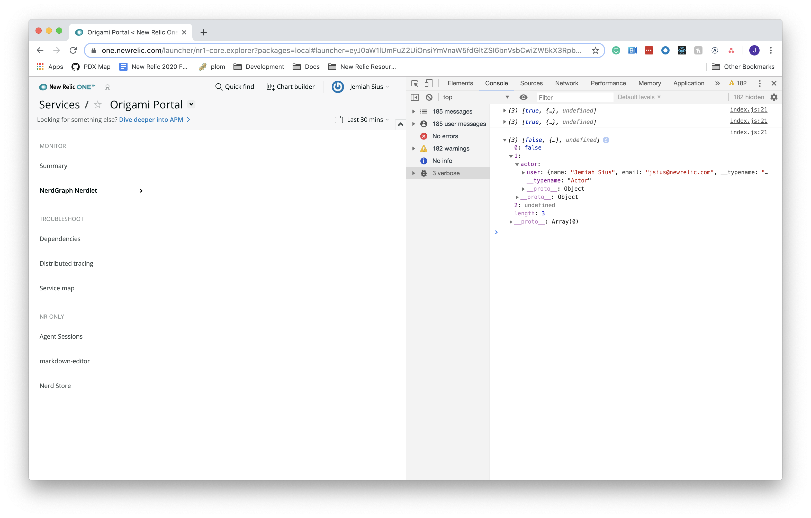
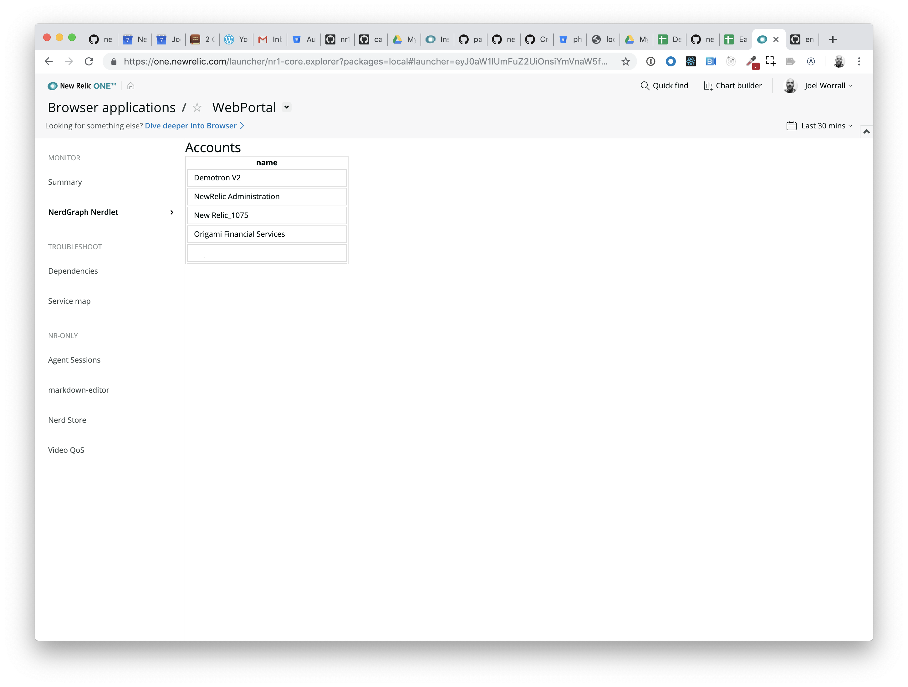
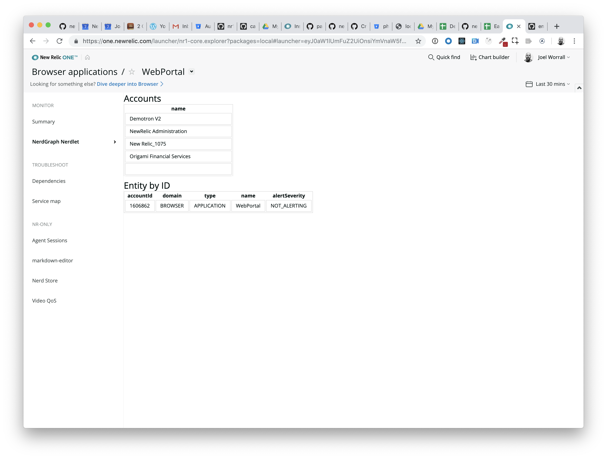
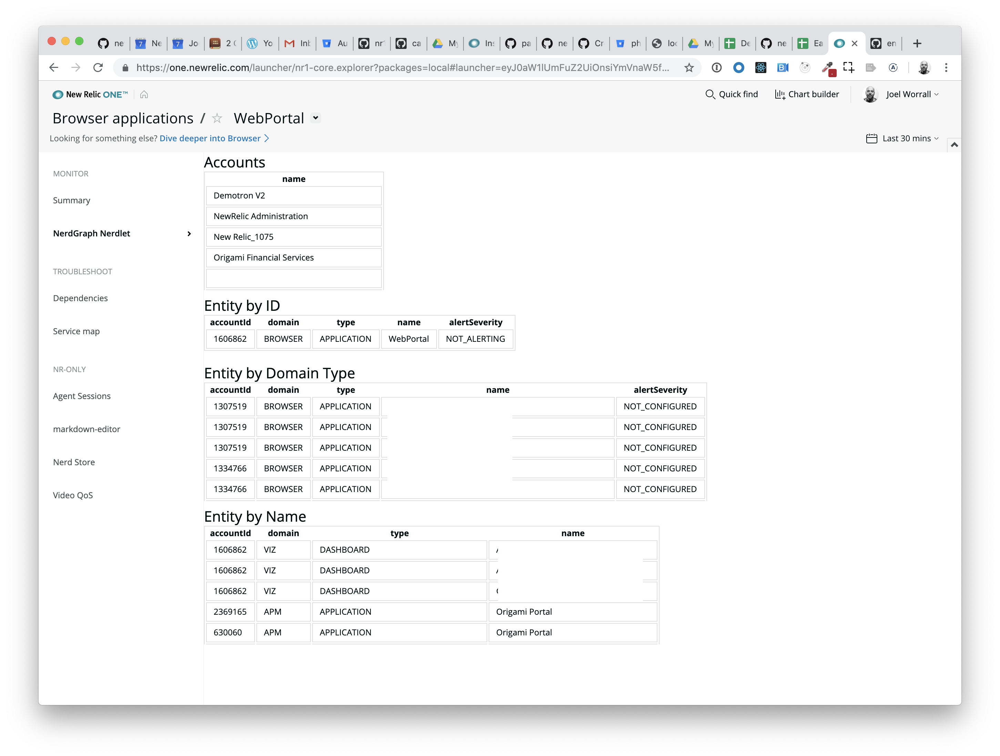
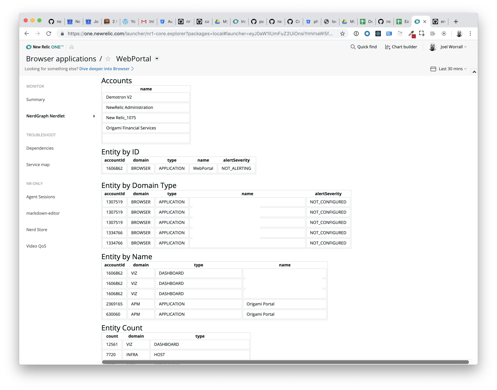

Lab 5: Using  NR1 GraphQL components
==============================================================================================

The purpose of this lab is to build on the concepts we've already explored, using `GraphQL` and exploring the `NerdGrpah` components to access New Relic's `GraphQL` API within your Nerdlets.

After completing this lab you should understand:

* Be more confident in your ability to incorporate `GraphQL`.
* Gain more practical experience with nerdGraph
* Have access to the GraphQL API form your Nerdlets

## Step 0: Setup and Prerequisites

Load the prequisites and follow the setup instructions in [Setup and Prequisites](../SETUP.md).

**Reminder**: Make sure that you're ready to go with your `lab5` by ensuring you've run the following commands:

```bash
# if we're not in the lab5 directory get there
cd ../lab5
npm install
npm start
```

Open the [Traffic Explorer Nerdlet here.](https://one.newrelic.com/launcher/lab5.my-launcher?packages=local#launcher=eyJ0aW1lUmFuZ2UiOnsiYmVnaW5fdGltZSI6bnVsbCwiZW5kX3RpbWUiOm51bGwsImR1cmF0aW9uIjoxODAwMDAwfX0=&pane=eyJuZXJkbGV0SWQiOiJsYWI1Lm15LW5lcmRsZXQifQ==)

## Step 1: Using the GraphQL API within your Nerdlet

1. We need to import the appropriate libraries into our Nerdlet. Open `lab5/nerdlets/lab5-nerdlet/index.js` and add the following near the top of the file.

```javascript
import { NerdGraphQuery} from 'nr1';
import gql from 'graphql-tag';
```

2. The `NerdGraphQuery` component is going to allow us to access the New Relic GraphQL API and have access to the power of GraphQl inside of your Nerdlet.

Let's update our render method in the `index.js` to use the `NerdGraphQuery` component and make our first GraphQL query.

```javascript
render() {
    return (
        <NerdGraphQuery query={gql `{actor {user {name email}}}`}>
            {({loading, error, data}) => {
                console.debug([loading, data, error]); //eslint-disable-line
                return null
            }}
        </NerdGraphQuery>
    )
}
```

3. Save `index.js` and watch the `NerdGraph Nerdlet` reload in your Browser.
4. Ctrl+click (or right click) on the web browser screen displaying our Nerdlet and choose the menu item `Inspect`.
5. In the DevTools window now open, click on the `Console` tab at the top.
6. In the `Console` tab, choose the `verbose` option on the left hand side. (It's in the drop-down next to the 'Filter' bar.)
7. Go back to the browser window and reload the current page, and then go back to the DevTools window. You should be looking at a screen like the following:



In your console, you should see an output matched the basic query you made using [GraphiQL](https://api.newrelic.com/graphiql) in `lab4`

## Step 2: Using the NerdGrpahQuery components

The `NerdGraphQuery` component returns set of data when making a query. The `loading`, `error`, and `data` objects that are all accessible from a child function within the `NerdGraphQuery`. Next we'll make some updated to our `index.js` file to output our account list on the screen

1. Update your import statement in the `index.js` files with the code below to add the `Spinner` and `DisplayText` from the `nr1` library:

```javascript
import {NerdGraphQuery, Spinner, DisplayText} from 'nr1';
```

2. Above your render method, add the render helper fuctions from the code below:

```javascript
_renderTable(data){
        const table = data.map((item, i) => {
            return <tr key={i}>
                <td  className="table-data">{item.name}</td>
            </tr>
        })
        return table;
    }

_renderAccounts(data){
    console.log(data)
    const table = data.map((item, i) => {
        return <tr key={i}>
            <td className="table-data">{item.name}</td>
        </tr>
    })
    return table;
}

_renderEntityById(data){
    const table = data.map((item, i) => {
        return <tr key={i}>
                <td className="table-data">{item.name}</td>
                <td className="table-data">{item.domain}</td>
            </tr>
    })
    return table;
}

_renderEntitiesByName(data){
    const table = data.map((item, i) => {
        return <tr key={i}>
                <td className="table-data">{item.name}</td>
                <td className="table-data">{item.domain}</td>
                <td className="table-data">{item.type}</td>
            </tr>
    })
    return table;
}

_renderEntityCount(data){
    const table = data.map((item, i) => {
        return <tr key={i}>
                <td className="table-data">{item.count}</td>
                <td className="table-data">{item.domain}</td>
                <td className="table-data">{item.type}</td>
            </tr>
    })
    return table;
}
```

3. Update your render method in the `index.js` files with the code below:

```javascript
render() {
    return (
        <Grid>
            <GridItem columnSpan={4}>
                <NerdGraphQuery query={gql `{actor {accounts {id name}}}`}>
                    {({loading, error, data}) => {
                        console.debug([loading, data, error]); //eslint-disable-line
                        if (loading) {
                            return <Spinner />;
                        }
                        if (error) {
                            return <DisplayText>{error}</DisplayText>;
                        }

                        const accounts =  this._renderTable(data.actor.accounts)
                        return <table className="table">
                                <tbody>
                                    {accounts}
                                </tbody>
                            </table>
                    }}
                </NerdGraphQuery>
            </GridItem>
        </Grid>
        )
    }
```

 Go back to the browser window and reload the current page, you should see a list with names and ids for all of the accounts your user has access to. You should be looking at a screen like the following:



## Step 3: Using the Pre-Defined Entity Query Components

Using the `NerdGraphQuery` allows you to access data from using any type of query to `NerdGraph`, but for convenience, additional components are provided, with pre-defined Entity Queries

1. We need to import the pre-defined entity queries from the nr1 library. Update the import statement in your `index.js` file with the code below:

```javascript
import {NerdGraphQuery, EntityByIdQuery, EntitiesByNameQuery, EntitiesByDomainTypeQuery, EntityCountQuery, Spinner, Grid, GridItem, DisplayText, List, ListItem} from 'nr1';
import get from 'lodash.get';
```

Add the helper methods to you `index.js` files about your render method:

```javascript
_renderAccounts(data){
        console.log(data)
        const table = data.map((item, i) => {
            // const keys = Object.values(item)
            // keys.map((key) => {
            //     return <td className="table-data">{item.key}</td>
            // })
            return <tr key={i}>
                <td className="table-data">{item.name}</td>
            </tr>
        })
        return table;
    }

    _renderEntityById(data){
        const table = data.map((item, i) => {
            return <tr key={i}>
                    <td className="table-data">{item.name}</td>
                    <td className="table-data">{item.domain}</td>
                </tr>
        })
        return table;
    }

    _renderEntitiesByName(data){
        const table = data.map((item, i) => {
            return <tr key={i}>
                    <td className="table-data">{item.name}</td>
                    <td className="table-data">{item.domain}</td>
                    <td className="table-data">{item.type}</td>
                </tr>
        })
        return table;
    }
```

2. To query data about the `entity` that we have currently selected we will use the `EntityByIdQuery`

```javascript
render() {
    return (
        <Grid>
            <GridItem columnSpan={6}>
                <EntityByIdQuery entityId={this.props.nerdletUrlState.entityId}>
                    {({loading, error, data}) => {
                        console.debug([loading, data, error]); //eslint-disable-line
                        if (loading) {
                            return <Spinner />;
                        }
                        if (error) {
                            return <DisplayText>{error}</DisplayText>;
                        }
                        console.log('EntityById', data)
                        const entity =  this._renderEntityById(data.actor.entities)
                        return <table className="table">
                                <thead>
                                    <tr>
                                        <th><h3>Entity Name</h3></th>
                                        <th><h3>Domain</h3></th>
                                    </tr>
                                </thead>
                                <tbody>
                                    {entity}
                                </tbody>
                            </table>
                    }}
                </EntityByIdQuery>
            </GridItem>
        </Grid>
        )
    }
```
 Save and go back to the browser window and reload the current page, you should see a list with names and ids for all of the accounts your user has access to. You should be looking at a screen like the following:



Your browser should show a small table that displays the name and domain of your current `entity` as a part of the data object that is returned from the `EntityByIdQuery`.

2. A quick way to search for `entities` by name we will use the `EntitiesByNameQuery` and pass the `name` prop equal to "portal'. Add the code below to your `index.js` file under the current `GridItem` component.

```javascript
<GridItem columnSpan={6}>
    <EntitiesByNameQuery name={this.state.entityName}>
        {({loading, error, data}) => {
            console.debug([loading, data, error]); //eslint-disable-line
            if (loading) {
                return <Spinner />;
            }
            if (error) {
                return <DisplayText>{error}</DisplayText>;
            }

            console.log('EntityByName',data)
            const entities =  this._renderEntitiesByName(data.actor.entitySearch.results.entities)
            return (
                <Fragment>
                    <div>
                        <h3 className="header">Entity By Name: {this.state.entityName}</h3>
                    </div>
                    <table className="table">
                        <thead>
                            <tr>
                                <th><h3>Entity Name</h3></th>
                                <th><h3>Domain</h3></th>
                                <th><h3>Type</h3></th>
                            </tr>
                        </thead>
                        <tbody>
                            {entities}
                        </tbody>
                    </table>
                </Fragment>
            )
        }}
    </EntitiesByNameQuery>
</GridItem>
```

 Save and go back to the browser window and reload the current page, you should see another table with all of the entities that match name you queried.

 Your screen will look like the following:


3. To quickly search through your account entities by domain and type we will use the `EntitiesByDomainTypeQuery`, add the code below to your `index.js` file under the last `GridItem`:

```javascript
<GridItem columnSpan={6}>
    <EntitiesByDomainTypeQuery entityDomain="BROWSER" entityType="APPLICATION">
        {({loading, error, data}) => {
            console.debug([loading, data, error]); //eslint-disable-line
            if (loading) {
                return <Spinner />;
            }
            if (error) {
                return <DisplayText>{error}</DisplayText>;
            }
            console.log('EntityByDomain', data)
            const entities =  this._renderEntitiesByName(data.actor.entitySearch.results.entities)
            return (
                <Fragment>
                    <div>
                        <h3 className="header">Entity By Domain Type</h3>
                    </div>
                    <table className="table">
                        <thead>
                            <tr>
                                <th><h3>Entity Name</h3></th>
                                <th><h3>Domain</h3></th>
                                <th><h3>Type</h3></th>
                            </tr>
                        </thead>
                        <tbody>
                            {entities}
                        </tbody>
                    </table>
                </Fragment>
                )
        }}
    </EntitiesByDomainTypeQuery>
</GridItem>
```
Save and go back to the browser window and reload the current page, you should another table that displays the name, domain, and type of the entities we've queried by domain. You should be looking at a screen like the following:




4. Using the `EntityCountQuey` you can quickly query the number of entities available for each entityDomain and entityType. Update your `index.js` file with the code below.

```javascript
<GridItem columnSpan={6}>
    <EntityCountQuery>
        {({loading, error, data}) => {
            console.debug([loading, data, error]); //eslint-disable-line
            if (loading) {
                return <Spinner />;
            }
            if (error) {
                return <DisplayText>{error}</DisplayText>;
            }
            console.log('EntityCountQuery', data)
            const entities =  this._renderEntityCount(data.actor.entitySearch.types)
            return (
                <div>
                    <div>
                        <h3 className="header">Entity Count</h3>
                    </div>
                    <table className="table">
                        <thead>
                            <tr>
                                <th><h3>Count</h3></th>
                                <th><h3>Domain</h3></th>
                                <th><h3>Type</h3></th>
                            </tr>
                        </thead>
                        <tbody>
                            {entities}
                        </tbody>
                    </table>
                </div>
                )
        }}
    </EntityCountQuery>
</GridItem>
```

Save and go back to the browser window and reload the current page, under the table for `EntityByNameQuery` you will see one more table. This new table should be displaying the data object from the `EntityCountQuery` showing the number of entities available for each entityDomain and entityType.

You should be looking at a screen like the following:



## Summary

In the end, your `index.js` should look like this.

```javascript
import React, {Fragment} from 'react';
import PropTypes from 'prop-types';
import {NerdGraphQuery, EntityByIdQuery, EntitiesByNameQuery, EntitiesByDomainTypeQuery, EntityCountQuery, Spinner, Grid, GridItem, DisplayText, Modal, Stack, StackItem, Button} from 'nr1';
import gql from 'graphql-tag';
import get from 'lodash.get';

export default class MyNerdlet extends React.Component {
    static propTypes = {
        width: PropTypes.number,
        height: PropTypes.number,
    };

    constructor(props){
        super(props)
        this.state = {
            entityName: "Portal",
            hideModal: true,
            showToast: false,
        }
        this.accountId = 1606862; //New Relic Demotron.
    }

    _renderAccounts(data){
        console.log(data)
        const table = data.map((item, i) => {
            return <tr key={i}>
                <td className="table-data">{item.name}</td>
            </tr>
        })
        return table;
    }

    _renderEntityById(data){
        const table = data.map((item, i) => {
            return <tr key={i}>
                    <td className="table-data">{item.name}</td>
                    <td className="table-data">{item.domain}</td>
                </tr>
        })
        return table;
    }

    _renderEntitiesByName(data){
        const table = data.map((item, i) => {
            return <tr key={i}>
                    <td className="table-data">{item.name}</td>
                    <td className="table-data">{item.domain}</td>
                    <td className="table-data">{item.type}</td>
                </tr>
        })
        return table;
    }

    _renderEntityCount(data){
        const table = data.map((item, i) => {
            return <tr key={i}>
                    <td className="table-data">{item.count}</td>
                    <td className="table-data">{item.domain}</td>
                    <td className="table-data">{item.type}</td>
                </tr>
        })
        return table;
    }

    render() {
        return (
            <Fragment>
                <Grid>
                    <GridItem columnSpan={12}>
                        <EntityByIdQuery entityId={this.props.nerdletUrlState.entityId}>
                            {({loading, error, data}) => {
                                console.debug([loading, data, error]); //eslint-disable-line
                                if (loading) {
                                    return <Spinner />;
                                }
                                if (error) {
                                    return <DisplayText>{error}</DisplayText>;
                                }
                                console.log('EntityById', data)
                                const entity =  this._renderEntityById(data.actor.entities)
                                return (
                                    <Fragment>
                                        <div>
                                            <h3 className="header">Entity By Id</h3>
                                        </div>
                                        <table className="table">
                                            <thead>
                                                <tr>
                                                    <th><h3>Entity Name</h3></th>
                                                    <th><h3>Domain</h3></th>
                                                </tr>
                                            </thead>
                                            <tbody>
                                                {entity}
                                            </tbody>
                                        </table>
                                    </Fragment>
                                )
                            }}
                        </EntityByIdQuery>
                    </GridItem>
                    <GridItem columnSpan={6}>
                        <EntitiesByNameQuery name={this.state.entityName}>
                            {({loading, error, data}) => {
                                console.debug([loading, data, error]); //eslint-disable-line
                                if (loading) {
                                    return <Spinner />;
                                }
                                if (error) {
                                    return <DisplayText>{error}</DisplayText>;
                                }

                                console.log('EntityByName',data)
                                const entities =  this._renderEntitiesByName(data.actor.entitySearch.results.entities)
                                return (
                                    <Fragment>
                                        <div>
                                            <h3 className="header">Entity By Name: {this.state.entityName}</h3>
                                        </div>
                                        <table className="table">
                                            <thead>
                                                <tr>
                                                    <th><h3>Entity Name</h3></th>
                                                    <th><h3>Domain</h3></th>
                                                    <th><h3>Type</h3></th>
                                                </tr>
                                            </thead>
                                            <tbody>
                                                {entities}
                                            </tbody>
                                        </table>
                                    </Fragment>
                                )
                            }}
                        </EntitiesByNameQuery>
                    </GridItem>
                    <GridItem columnSpan={6}>
                        <EntitiesByDomainTypeQuery entityDomain="BROWSER" entityType="APPLICATION">
                            {({loading, error, data}) => {
                                console.debug([loading, data, error]); //eslint-disable-line
                                if (loading) {
                                    return <Spinner />;
                                }
                                if (error) {
                                    return <DisplayText>{error}</DisplayText>;
                                }
                                console.log('EntityByDomain', data)
                                const entities =  this._renderEntitiesByName(data.actor.entitySearch.results.entities)
                                return (
                                    <Fragment>
                                        <div>
                                            <h3 className="header">Entity By Domain Type</h3>
                                        </div>
                                        <table className="table">
                                            <thead>
                                                <tr>
                                                    <th><h3>Entity Name</h3></th>
                                                    <th><h3>Domain</h3></th>
                                                    <th><h3>Type</h3></th>
                                                </tr>
                                            </thead>
                                            <tbody>
                                                {entities}
                                            </tbody>
                                        </table>
                                    </Fragment>
                                    )
                            }}
                        </EntitiesByDomainTypeQuery>
                    </GridItem>
                    <GridItem columnSpan={6}>
                        <EntityCountQuery>
                            {({loading, error, data}) => {
                                console.debug([loading, data, error]); //eslint-disable-line
                                if (loading) {
                                    return <Spinner />;
                                }
                                if (error) {
                                    return <DisplayText>{error}</DisplayText>;
                                }
                                console.log('EntityCountQuery', data)
                                const entities =  this._renderEntityCount(data.actor.entitySearch.types)
                                return (
                                    <div>
                                        <div>
                                            <h3 className="header">Entity Count</h3>
                                        </div>
                                        <table className="table">
                                            <thead>
                                                <tr>
                                                    <th><h3>Entity Name</h3></th>
                                                    <th><h3>Domain</h3></th>
                                                    <th><h3>Type</h3></th>
                                                </tr>
                                            </thead>
                                            <tbody>
                                                {entities}
                                            </tbody>
                                        </table>
                                    </div>
                                    )
                            }}
                        </EntityCountQuery>
                    </GridItem>
                </Grid>
            </Fragment>
            )
        }
 }
```


