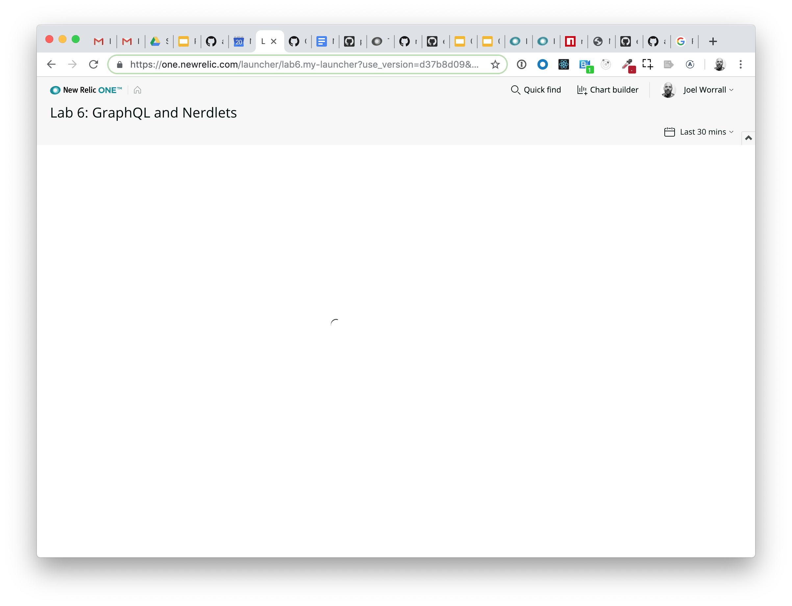
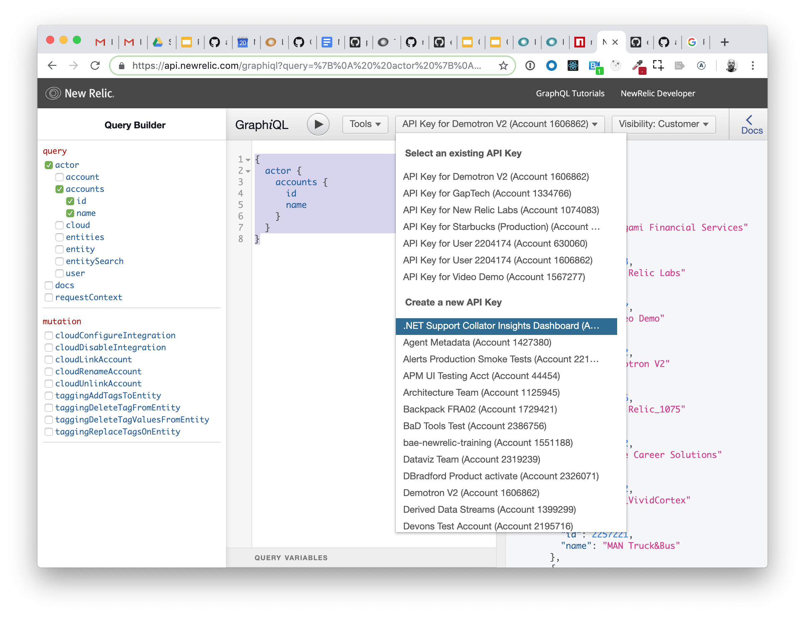
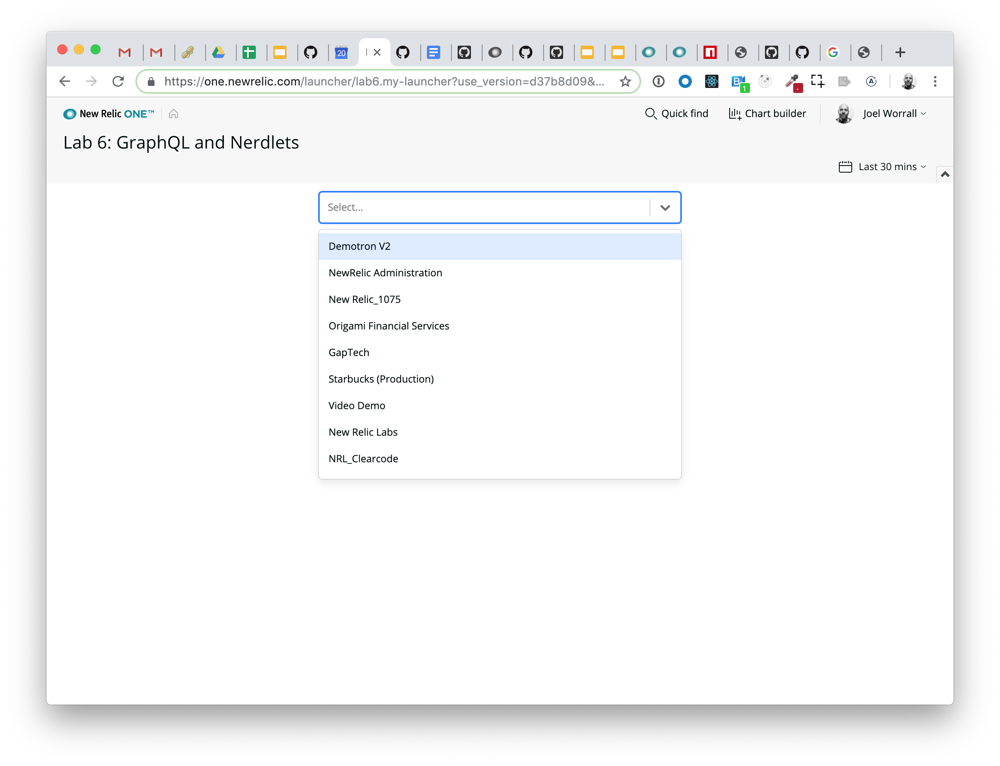
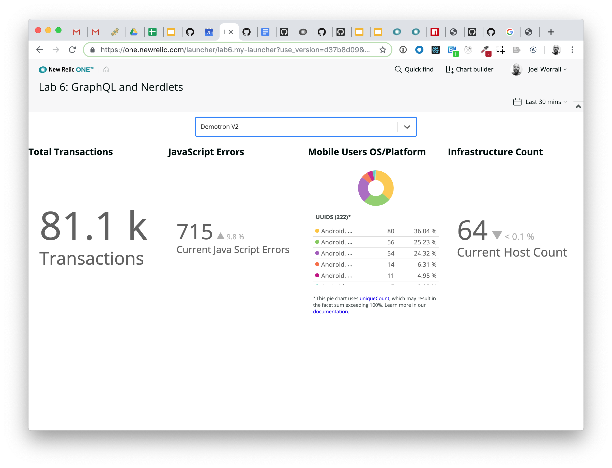

# Lab 6: GraphQL and Nerdlets

The purpose of this lab is twofold:

1. To expose learners to the fundamentals of New Relic's GraphQL interface, and
2. To offer hands-on experience in interacting with the part of the NR1 SDK that can issue GraphQL requests, `NerdGraphQuery`.

After completing this lab you should understand:

* How to issue `queries` to New Relic's GraphQL service
* How to issue a request to the New Relic `NerdGraphQuery` service from within a Nerdlet
* A pattern/practice for making use of data from an asynchronous request in a Nerdlet

## Step 0: Setup and Prerequisites

Load the prequisites and follow the setup instructions in [Setup](../SETUP.md).

**Reminder**: Make sure that you're ready to go with your `lab6` by ensuring you've run the following commands:

```bash
# from the nr1-workshop directory
cd lab6
nr1 nerdpack:uuid -gf
npm install
npm start
```

Open a web browser to `https://one.newrelic.com?nerdpacks=local`, and click on the Launcher titled `Lab 6: GraphQL and Nerdlets`. You should come to screen that looks like the following.



## Step 1: Interacting with New Relic's GraphQL service

1. Navigate to the New Relic GraphiQL interface at: `https://api.newrelic.com/graphiql`

2. If you don't have a valid **API Key**, create one using the drop down option in the center/top of the interface (see below):


3. Notice the **Query Builder** on the left side of the screen. Click the following items:
- `actor`
- under `actor`, click `accounts`
- under `accounts`, click `id`
- under `accounts`, click `name`

_Note: we're building a GraphQL query to request the list of the accounts to which a user has access. This is going to be used in our Nerdlet._

The resulting GraphQL statement should look like the following:

```graphql
{
  actor {
    accounts {
      id
      name
    }
  }
}
```

4. Click the Play button at the top of the screen and review the results in the right-hand panel. That GraphQL query


## Step 2: Adding a GraphQL request to a Nerdlet

In this step, we're going to issue a GraphQL query within a React lifecycle method, process the results and use them to build a `Select` box.

1. Open `lab6/nerdlets/my-nerdlet/index.js` in your code editor.

```bash
code lab6/nerdlets/my-nerdlet/index.js
```

_Note: There's a lot more code in this initial file. Take a few moments to review what's going on. If you trace the logic in the `render` method, it'll become obvious why we're getting the `Spinner` on the screen: we haven't loaded any accounts._

2. We're going to add some libraries to to our project that we're going to need. So let's start with adding them to our package.json

```bash
npm install --save graphql graphql-tag react-select
```

3. Next, let's add an import to the top of our `lab6/nerdlets/my-nerdlet/index.js` file.

```javascript
import gql from 'graphql-tag';
```

4. Now, we're going to issue a GraphQL request in the `componentDidMount` React lifecycle method using the query we built earlier and loading those results into the `state.accounts` object. Add the following method to the `lab6/nerdlets/my-nerdlet/index.js` file.

```javascript
    componentDidMount() {
        //being verbose for demonstration purposes only
        const q = NerdGraphQuery.query({ query: gql`{
            actor {
              accounts {
                id
                name
              }
            }
          }` });
        q.then(results => {
            //logged for learning purposes
            console.debug(results); //eslint-disable-line
            const accounts = results.data.actor.accounts.map(account => {
                return account;
            });
            const account = accounts.length > 0 && accounts[0];
            this.setState({ selectedAccount: account, accounts });
        }).catch((error) => { console.log(error); })
    }
```

5. Add the following filter logic and `Dropdown` and `DropdownItem` components to the `render` method to make use of our new `state` data.

```javascript
    render() {
        const { accounts, selectedAccount } = this.state;

        // Logic for filtering our account listing Dropdown
        const {filter} = (this.state || {})

        if(filter && filter.length > 0) {
            const re = new RegExp(filter, 'i')
            accounts = accounts.filter(a => {
                return a.name.match(re)
            })
        }

        if (accounts) {
            const options = accounts.map(account => {
                return {
                    label: account.name,
                    value: account.id,
                    account
                }
            });
            const selectedOption = selectedAccount ? { label: selectedAccount.name, value: selectedAccount.id, account: selectedAccount } : null;
            console.log([accounts, selectedAccount, selectedOption, options]);
            return <Stack directionType={Stack.DIRECTION_TYPE.VERTICAL}>
                {selectedAccount &&
                    <StackItem>
                        <Dropdown title={selectedAccount.name} filterable label="Account"
                            onChangeFilter={(event) => this.setState({filter: event.target.value})}>
                        {accounts.map(a => {
                            return <DropdownItem key={a.id} onClick={() => selectAccount(a)}>
                            {a.name}
                            </DropdownItem>
                        })}
                        </Dropdown>
                    </StackItem>
                }
                {selectedAccount && ...
                ...
                ...
```

6. Our `Dropdown` component references a `selectAccount` in the `onClick` event, so we need to define that.

Add the following method to the `lab6/nerdlets/my-nerdlet/index.js` file:

```javascript
    /**
     * Option contains a label, value, and the account object.
     * @param {Object} option
     */
    selectAccount(option) {
        this.setState({ selectedAccount: option.account });
    }
```

and add this declaration to the `constructor` method:

```javascript
    this.selectAccount = this.selectAccount.bind(this)
```

Note: At this point, your `lab6/nerdlets/my-nerdlet/index.js` file should look like the following:

```javascript
import React from 'react';
import PropTypes from 'prop-types';
import { Dropdown, DropdownItem, Spinner, Stack, StackItem, BillboardChart, PieChart, NerdGraphQuery } from 'nr1';
import gql from 'graphql-tag';

export default class MyNerdlet extends React.Component {
    static propTypes = {
        width: PropTypes.number,
        height: PropTypes.number,
        launcherUrlState: PropTypes.object
    };

    constructor(props) {
        super(props)
        this.selectAccount = this.selectAccount.bind(this)

        console.debug(props) // eslint-disable-line
        this.state = {
            accounts: null,
            selectedAccount: null
        }
    }

    /**
     * Build the array of NRQL statements based on the duration from the Time Picker.
     */
    nrqlChartData() {
        const { duration } = this.props.launcherUrlState.timeRange;
        const durationInMinutes = duration/1000/60;
        return [
            {
                title: 'Total Transactions',
                nrql: `SELECT count(*) from Transaction SINCE ${durationInMinutes} MINUTES AGO`
            },
            {
                title: 'JavaScript Errors',
                nrql: `SELECT count(*) FROM JavaScriptError SINCE ${durationInMinutes} MINUTES AGO COMPARE WITH ${durationInMinutes*2} MINUTES AGO`
            },
            {
                title: 'Mobile Users OS/Platform',
                nrql: `FROM MobileSession SELECT uniqueCount(uuid) FACET osName, osVersion SINCE ${durationInMinutes} MINUTES AGO`,
                chartType: 'pie'
            },
            {
                title: 'Infrastructure Count',
                nrql: `SELECT uniqueCount(entityGuid) as 'Host Count' from SystemSample SINCE ${durationInMinutes} MINUTES AGO COMPARE WITH ${durationInMinutes*2} MINUTES AGO`
            }
        ];
    }

        componentDidMount() {
        //being verbose for demonstration purposes only
        const q = NerdGraphQuery.query({ query: gql`{
            actor {
              accounts {
                id
                name
              }
            }
          }` });
        q.then(results => {
            //logged for learning purposes
            console.debug(results); //eslint-disable-line
            const accounts = results.data.actor.accounts.map(account => {
                return account;
            });
            const account = accounts.length > 0 && accounts[0];
            this.setState({ selectedAccount: account, accounts });
        }).catch((error) => { console.log(error); })
    }

     /**
     * Option contains a label, value, and the account object.
     * @param {Object} option
     */
    selectAccount(option) {
        this.setState({ selectedAccount: option.account });
    }

    render() {
        const { accounts, selectedAccount } = this.state;

        // Logic for filtering our account listing Dropdown
        const {filter} = (this.state || {})

        if(filter && filter.length > 0) {
            const re = new RegExp(filter, 'i')
            accounts = accounts.filter(a => {
                return a.name.match(re)
            })
        }

        if (accounts) {
            return <Stack directionType={Stack.DIRECTION_TYPE.VERTICAL}>
                {selectedAccount &&
                    <StackItem>
                        <Dropdown title={selectedAccount.name} filterable label="Account"
                            onChangeFilter={(event) => this.setState({filter: event.target.value})}>
                        {accounts.map(a => {
                            return <DropdownItem key={a.id} onClick={() => selectAccount(a)}>
                            {a.name}
                            </DropdownItem>
                        })}
                        </Dropdown>
                    </StackItem>
                }
                {selectedAccount &&
                    <StackItem>
                        <Stack
                            directionType={Stack.DIRECTION_TYPE.HORIZONTAL}>
                            {this.nrqlChartData().map((d, i) => <StackItem key={i} shrink={true}>
                                <h2>{d.title}</h2>
                                {d.chartType == 'pie' ? <PieChart
                                    accountId={selectedAccount.id}
                                    query={d.nrql}
                                    className="chart"
                                /> : <BillboardChart
                                    accountId={selectedAccount.id}
                                    query={d.nrql}
                                    className="chart"
                                />}
                            </StackItem>)}
                        </Stack>
                    </StackItem>
                }
            </Stack>
        } else {
            return <Spinner fillContainer />
        }
    }
}
```

7. Save `lab6/nerdlets/my-nerdlet/index.js` and reload. When the Nerdlet reloads, you should see a `Select` box with a list of the accounts to which you have access.



8. Choose one. You should see a screen that looks like the following.


# For Consideration / Discussion

* Consider how the pattern of interacting with a GraphQL request (or any other external request) could be leveraged to generate useful, actionable interfaces. What are the possible uses? What are the possible limitations? Is there a use case / challenge you've encountered that could benefit from this type of flexibility?