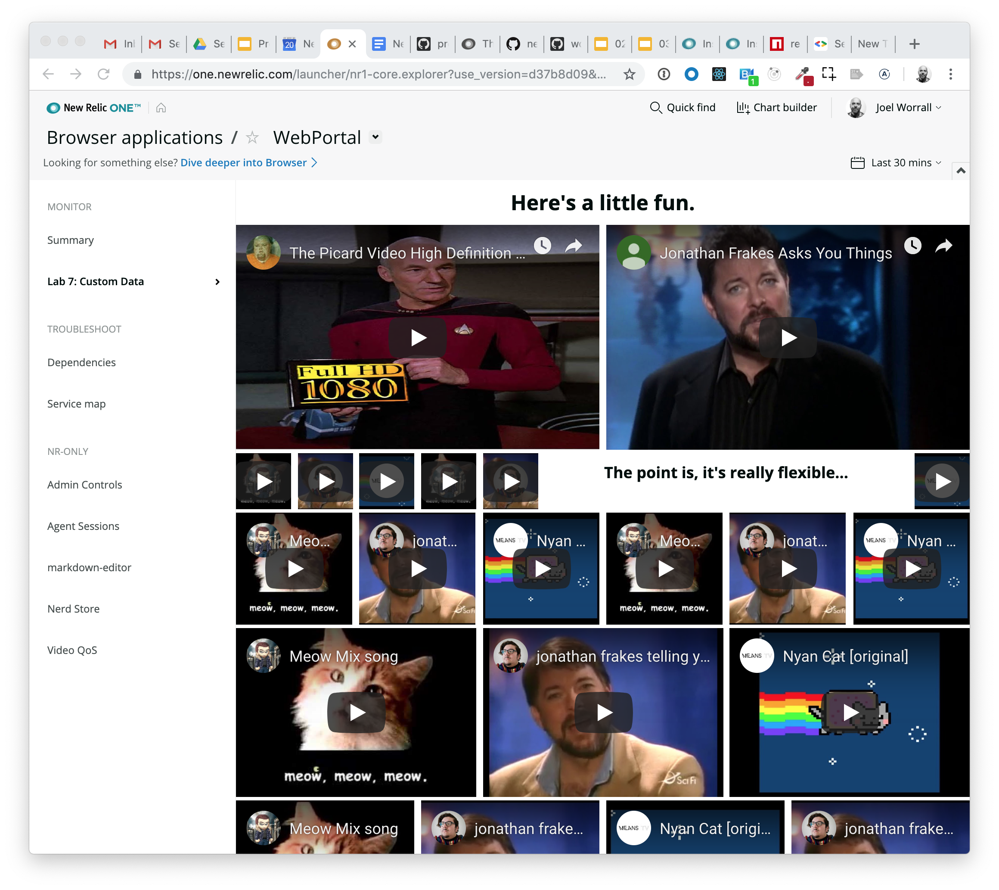
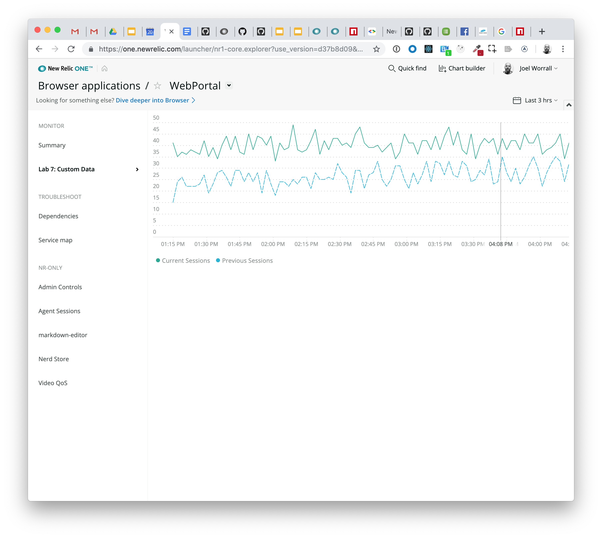
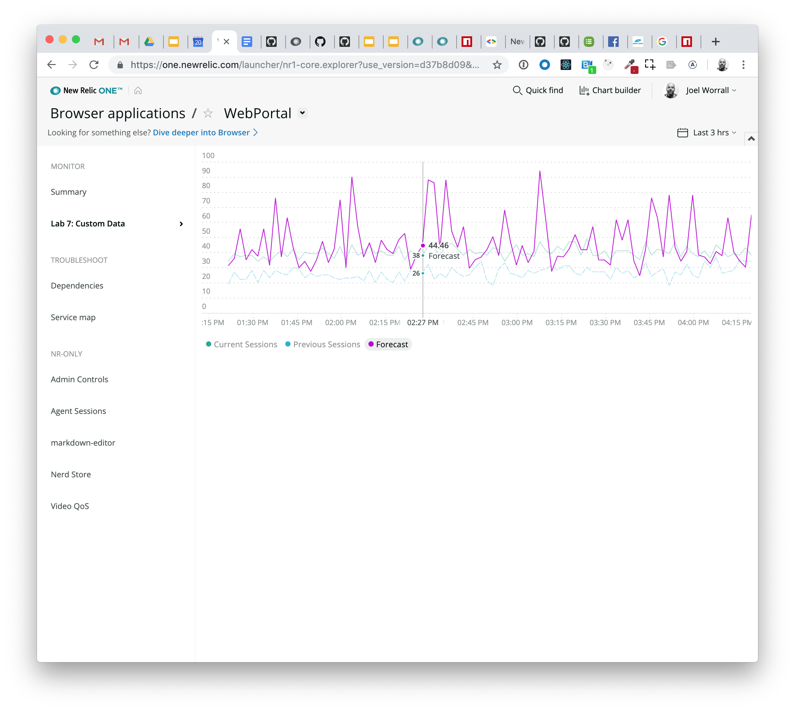

Lab 7: Passing custom data to a Chart component
===========================================================

The purpose of this lab is to demonstrate how to incorporate 3rd party data into a standard visualization in NR1. To do that, we're going to *simulate* a set of forecasting data and incorporate that data into a `LineChart` that is displaying a timeseries of `PageViews`.

After completing this lab you should understand:

* How to generate a data series that can be processed by an NR1 Chart component.

## Step 0: Setup and Prerequisites

Load the prequisites and follow the setup instructions in [Setup](../SETUP.md).

**Reminder**: Make sure that you're ready to go with your `lab7` by ensuring you've run the following commands:

```bash
# from the nr1-eap-workshop directory
cd lab7
npm install
```

## Step 1: Accessing the Nerdlet

You'll notice that this `Nerdlet` doesn't have a corresponding `Launcher`, so we're going to need to find it.

1. Open the file `lab7/nerdlets/my-nerdlet/nr1.json` and check out the contents. They look like the following. There are two attributes we want to pay attention to: `entities` and `actionCategory`.

```json
{
    "schemaType": "NERDLET",
    "id": "my-nerdlet",
    "description": "Describe me",
    "displayName": "Lab 7: Custom Data",
    "entities": [{"domain": "BROWSER", "type": "APPLICATION"}],
    "actionCategory": "monitor"
}
```

2. Open a web browser to `https://one.newrelic.com?use_version=d37b8d09&packages=local` c
3. Click on the `Entity Explorer`
4. Click on `Browswer Applications` category in the left-hand navigation
5. Click on any browser application from the list
6. You should **now** see a menu option in the left-hand navigation called `Lab 7: Custom Data`
7. Click on `Lab 7: Custom Data`

You should come to screen that looks like the following:



_Note: before you become concerned, cats and Star Trek have nothing to do with this exercise. Consider it a fun way to demonstrate what you can do with a `Grid` layout in NR1._

## Step 2: Charting a timeseries of `PageView` events


1. Before we get going, take a moment to look at the `props` being printed out in the browser's `Console`. There's new content in the the `nerdletUrlState`, specifically an `entityId`. This is going to prove important in our `render` method.


_Note: the `entityId` is actually a Base64 encoded concatenation of the accountId, entity domain, entity type, and domain/type unique ID of that entity. We'll dissect that more below._

2. Add the following imports near the top of your `lab7/nerdlets/my-nerdlet/index.js`

```javascript
import { NrqlQuery, Spinner, LineChart } from 'nr1';
import { decodeGuid, loadEntity, generateForecastData } from './utils';
```

We're going to use the `NrqlQuery` component to populate a `LineChart` using its `data` attribute.

_If you're thinking, "based on what I've already learned, a `LineChart` doesn't need a custom data set. It can process a NRQL query on its own." You're correct. However, we're going to eventually add an additional series of data to the result we get back from our `NrqlQuery` **before** the data is passed to the `LineChart`, so keep tracking._

3. Replace the `render` method content (bye bye _Captain_ and _#1_) with the following component definition:

```javascript
    render() {
        const { entity } = this.state;
        if (entity) {
            const accountId = this._getAccountId();
            const { duration } = this.props.launcherUrlState.timeRange;
            const durationInMinutes =  duration/1000/60;
            return <NrqlQuery accountId={accountId} query={`SELECT uniqueCount(session) FROM PageView WHERE appName = '${entity.name.replace("'", "\\'")}' TIMESERIES SINCE ${durationInMinutes} MINUTES AGO COMPARE WITH ${durationInMinutes*2} MINUTES AGO`}>
                {({ loading, data, error })  => {
                    console.debug([loading, data, error]); //eslint-disable-line
                    if (loading) {
                        return <Spinner className="centered" />;
                    }
                    if (error) {
                        return <DisplayText>{error}</DisplayText>;
                    }
                    return <LineChart data={data} className="chart"/>;
                }}
            </NrqlQuery>
        } else {
            return <Spinner className="centered" />
        }
    }
```

Study that code and ensure you've got a solid handle on what's going on there. If you don't, ask questions. Now... Seriously... Do it.

4. Replace the `constructor` method with the following:

```javascript
constructor(props) {
    super(props);
    //logging for learning purposes only
    console.debug(props); //eslint-disable-line
    this.state = {
        entity: null
    };
}
```

5. Open the `lab7/nerdlets/my-nerdlet/utils.js` and review each of the methods in that file. We're going to make use of three of them now.

6. Add the following method to `lab7/nerdlets/my-nerdlet/index.js`. We're going to use this a shorthand way of getting the accountId from a decoded EntityId.

```javascript
    _getAccountId() {
        return decodeEntityId(this.props.nerdletUrlState.entityId)[0];
    }
```

_Note: the New Relic entityId is a GUID that is made up of four components: an accountId, an entity domain, an entity type, and a unique ID within that domain/type combo all base64 encoded. So when you have an entityId, you are a decode away from access to all of that information._

7. Now, we need to load the Entity from New Relic so that we can get access to the Browser Applicaton name. To do that, we're going to make use of two React lifecycle methods and a utility method from our `utils` file. Add the following to `lab7/nerdlets/my-nerdlet/index.js`.

```javascript
    componentDidMount() {
        loadEntity(this.props.nerdletUrlState.entityId).then(entity => {
            this.setState({ entity});
        });
    }

    componentWillUpdate(nextProps) {
        if (this.props && this.props.nerdletUrlState.entityId != nextProps.nerdletUrlState.entityId) {
            loadEntity(this.props.nerdletUrlState.entityId).then(entity => {
                this.setState({ entity});
            });
        }
        return true;
    }
```

8. Save the file and reload. You should see something like the following:



You should see a current and yesterday, but no Forecast data. Let's make some.

## Step 3: Adding a series of data to feed into a Chart

We're only one line of code away from our preferred outcome thanks to the `generateForecastData` function we imported earlier. If you haven't looked over the 20+ lines of code, please do so now. I'll give you an appropriate picture of what's needed to generate a chart data series.

1. Add the following line to the `render` method of the `lab7/nerdlets/my-nerdlet/index.js`, just above the `return <LineChart...` line.

```javascript
    ...
    data.push(generateForecastData(data[0]));
    return <LineChart data={data} className="chart"/>;
    ...
```

2. Save the file and reload. You should see something like this.


The final code in `lab7/nerdlets/my-nerdlet/index.js` should look something like this:

```javascript
import React from 'react';
import PropTypes from 'prop-types';
import { Grid, GridItem } from 'nr1';
import { NrqlQuery, Spinner, LineChart } from 'nr1';
import { decodeEntityId, loadEntity, generateForecastData } from './utils';

export default class MyNerdlet extends React.Component {
    static propTypes = {
        width: PropTypes.number,
        height: PropTypes.number,
        launcherUrlState: PropTypes.object
    };

    _getAccountId() {
        return decodeEntityId(this.props.nerdletUrlState.entityId)[0];
    }

    constructor(props) {
        super(props);
        console.debug(props); //eslint-disable-line
        this.state = {
            entity: null
        }
    }

    componentDidMount() {
        loadEntity(this.props.nerdletUrlState.entityId).then(entity => {
            this.setState({ entity});
        });
    }

    componentWillUpdate(nextProps) {
        if (this.props && this.props.nerdletUrlState.entityId != nextProps.nerdletUrlState.entityId) {
            loadEntity(this.props.nerdletUrlState.entityId).then(entity => {
                this.setState({ entity});
            });
        }
        return true;
    }

    render() {
        const { entity } = this.state;
        if (entity) {
            const accountId = this._getAccountId();
            const { duration } = this.props.launcherUrlState.timeRange;
            const durationInMinutes =  duration/1000/60;
            return <NrqlQuery accountId={accountId} query={`SELECT uniqueCount(session) FROM PageView WHERE appName = '${entity.name.replace("'", "\\'")}' TIMESERIES SINCE ${durationInMinutes} MINUTES AGO COMPARE WITH ${durationInMinutes*2} MINUTES AGO`}>
                {({ loading, data, error })  => {
                    console.debug([loading, data, error]); //eslint-disable-line
                    if (loading) {
                        return <Spinner className="centered" />;
                    }
                    if (error) {
                        return <DisplayText>{error}</DisplayText>;
                    }
                    data.push(generateForecastData(data[0]));
                    return <LineChart data={data} className="chart"/>;
                }}
            </NrqlQuery>

        } else {
            return <Spinner className="centered" />
        }
    }
}
```

# For Consideration / Discussion

* What other types of data might you chose to intermingle with performance data?
* Does it make sense why the `Lab 7: Custom Data` Nerdlet was only displaying for `Browser Application` instances? FYI, a value of `entities: [*]` makes a Nerdlet available for all Entity Types.
